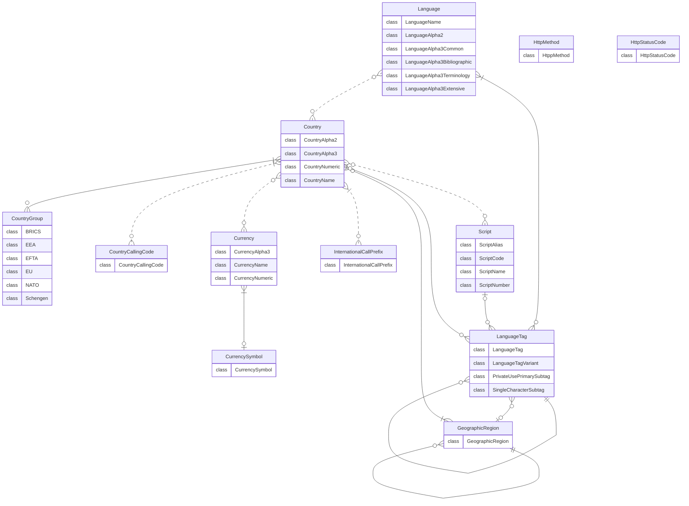
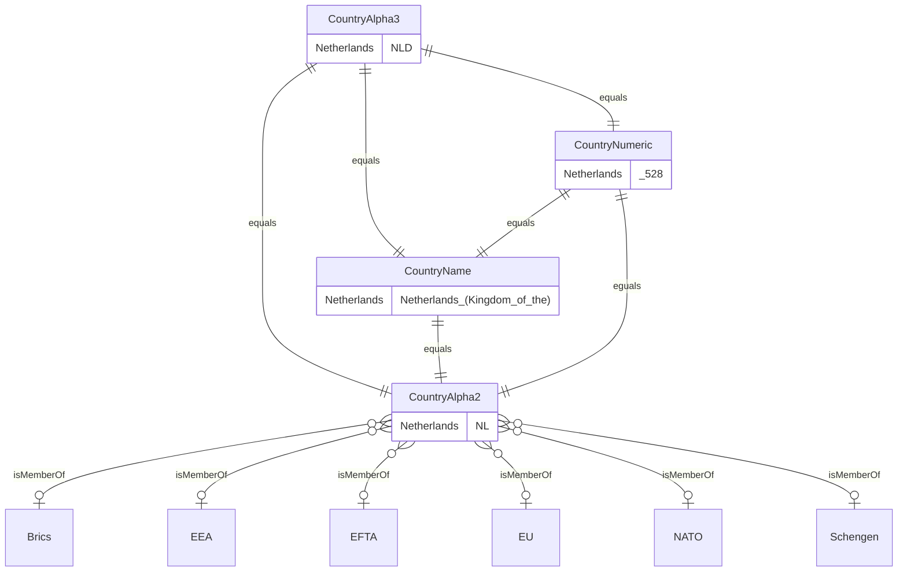
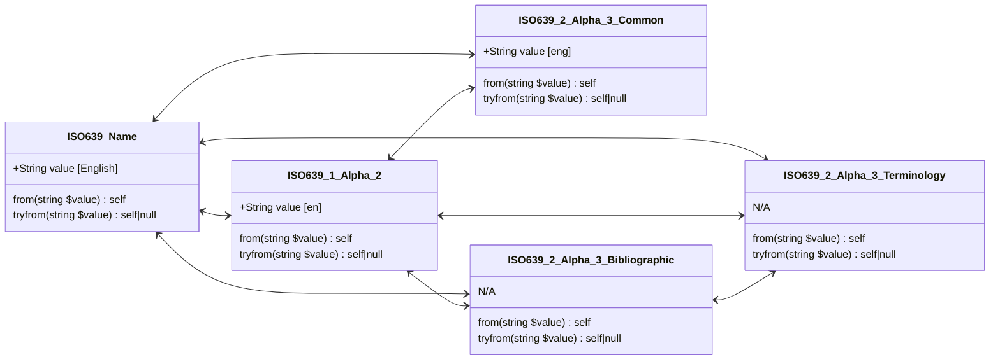
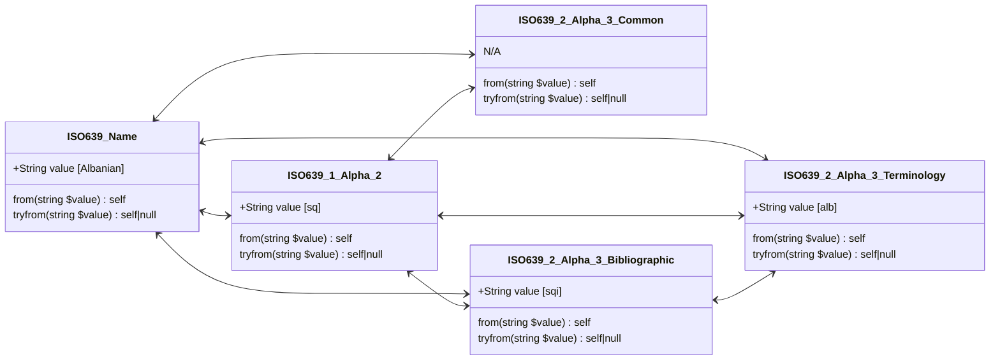

<picture>
    <source srcset="docs/images/banner_dark.png" media="(prefers-color-scheme: dark)">
    
</picture>

# Standards


[](https://codecov.io/gh/PrinsFrank/standards)

**A collection of standards as PHP Enums**

Daily updated from their sources, whether it is ISO or IANA directly, or a maintaining party like the SIX Group or the US Library of Congress.

## Setup

> **Note**
> Make sure you are running PHP 8.1 or higher to use this package

To start right away, run the following command in your composer project;

```composer require prinsfrank/standards```

Or for development only;

```composer require prinsfrank/standards --dev```

## How this package works

This package implements a bunch of specs as PHP Enums, so you can typehint them in methods. Currently, all specs are implemented as backed enums. That means that besides a name, they have also an internal 'value', either as an integer or a string.

In the Country, Currency and language specifications, there is also a relation between different enums. For example, the Alpha2 country code 'NL' is related to the Alpha3 'NLD', the numeric value '528' and the name 'Netherlands (the)'. Internally, these specs rely on the fact that the keys for these values are identical, so it is possible to convert between these.

## Entities and their relations

All specifications in this package are closely related, except for the Http status code and methods. Not all relations are bidirectional though. For example, a language tag is build up of a language and optionally a country, but only a country cannot be converted to a language tag. 

Below you can find an overview of all the relationships between specifications. As not all relationships are implemented yet, a dotted line indicates when there is a relationship, but that has not yet been implemented in this package.



## Upgrading

This package adheres to [semver](https://semver.org/). This means that there are no breaking changes between minor releases (for example from 1.1 to 1.2), but that breaking changes are released as a major release (for example from 1.x to 2.x). To read about upgrading from one major release to the next, please refer to the [UPGRADING.md](./UPGRADING.md) file in the root of this project. 

## Country (ISO3166-1)

[](https://github.com/PrinsFrank/standards/actions/workflows/update-spec-country.yml)

> :mortar_board: **Alpha2/3 country codes are always UPPERCASE to avoid confusion with language codes. It is recommended to use Alpha2/Alpha3 codes when exposing the specification in APIs**

### At a glance

All the Alpha2, Alpha3, Numeric and Name values have a corresponding enum in the other country enums. These can be converted using their corresponding methods (toAlpha2, toAlpha3 etc...).

Country group membership can be checked by calling the `isMemberOf` method, supplying the FQN of a class that implements the `GroupInterface`. Several country groups are available: BRICS, EEA, EFTA etc.

```php
CountryAlpha2::from('NL');                                    // CountryAlpha2::Netherlands
CountryNumeric::from('528');                                  // CountryNumeric::Netherlands
CountryNumeric::fromInt(528);                                 // CountryNumeric::Netherlands
CountryAlpha3::from('NLD');                                   // CountryAlpha3::Netherlands
CountryAlpha3::from('NLD')->value;                            // 'NLD'
CountryAlpha3::from('NLD')->name;                             // 'Netherlands'
CountryAlpha3::from('NLD')->toCountryAlpha2()->value;         // 'NL'
CountryAlpha3::from('NLD')->toCountryNumeric()->value;        // '528'
CountryAlpha3::from('NLD')->toCountryNumeric()->valueAsInt(); // 528
CountryAlpha3::from('NLD')->toCountryName()->value;           // 'Netherlands (Kingdom of the)'
CountryAlpha3::from('NLD')->isMemberOf(EU::class);            // true
CountryAlpha2::Netherlands;                                   // CountryAlpha2::Netherlands

public function foo(CountryAlpha2 $countryAlpha2) {}          // Use spec as typehint to enforce valid value

```

<details>
    <summary>Full documentation</summary>



### CountryAlpha2

```php
$valueAlpha2 = CountryAlpha2::from('NL');         // CountryAlpha2::Netherlands
$value = $valueAlpha2->value;                     // 'NL'
$valueName = $valueAlpha2->name;                  // 'Netherlands'
$valueAlpha3 = $valueAlpha2->toCountryAlpha3();   // CountryAlpha3::Netherlands
$valueNumeric = $valueAlpha2->toCountryNumeric(); // CountryNumeric::Netherlands
$valueName = $valueAlpha2->toCountryName();       // CountryName::Netherlands

$nameString = $valueAlpha2->toCountryName()->value; // 'Netherlands (Kingdom of the)'

$isMemberOfEu = $valueAlpha2->isMemberOf(EU::class);       // true
$isMemberOfBrics = $valueAlpha2->isMemberOf(Brics::class); // false
```

### CountryAlpha3

```php
$valueAlpha3 = CountryAlpha3::from('NLD');        // CountryAlpha3::Netherlands
$value = $valueAlpha3->value;                     // 'NLD'
$valueName = $valueAlpha3->name;                  // 'Netherlands'
$valueAlpha2 = $valueAlpha3->toCountryAlpha2();   // CountryAlpha2::Netherlands
$valueNumeric = $valueAlpha3->toCountryNumeric(); // CountryNumeric::Netherlands
$valueName = $valueAlpha3->toCountryName();       // CountryName::Netherlands

$nameString = $valueAlpha3->toCountryName()->value; // 'Netherlands (Kingdom of the)'

$isMemberOfEu = $valueAlpha3->isMemberOf(EU::class);       // true
$isMemberOfBrics = $valueAlpha3->isMemberOf(Brics::class); // false
```

### CountryNumeric

```php
$valueNumeric = CountryNumeric::from('528');     // CountryNumeric::Netherlands
$valueNumeric = CountryNumeric::fromInt(528);    // CountryNumeric::Netherlands
$value = $valueNumeric->value;                   // '528'
$valueName = $valueNumeric->name;                // 'Netherlands'
$valueAlpha2 = $valueNumeric->toCountryAlpha2(); // CountryAlpha2::Netherlands
$valueAlpha3 = $valueNumeric->toCountryAlpha3(); // CountryAlpha3::Netherlands
$valueName = $valueNumeric->toCountryName();     // CountryName::Netherlands

$nameString = $valueNumeric->toCountryName()->value; // 'Netherlands (Kingdom of the)'

$isMemberOfEu = $valueNumeric->isMemberOf(EU::class);       // true
$isMemberOfBrics = $valueNumeric->isMemberOf(Brics::class); // false
```

### CountryName

```php
$valueName = CountryName::from('Netherlands (Kingdom of the)'); // CountryName::Netherlands
$value = $valueName->value;                                     // 'Netherlands (Kingdom of the)'
$valueName = $valueName->name;                                  // 'Netherlands'
$valueAlpha2 = $valueName->toCountryAlpha2();                   // CountryAlpha2::Netherlands
$valueAlpha3 = $valueName->toCountryAlpha3();                   // CountryAlpha3::Netherlands
$valueNumeric = $valueName->toCountryNumeric();                 // CountryNumeric::Netherlands

$isMemberOfEu = $valueName->isMemberOf(EU::class);       // true
$isMemberOfBrics = $valueName->isMemberOf(Brics::class); // false
```

</details>

## Country Calling Codes (ITU-T E.164)

> :mortar_board: **Country calling codes can be anywhere from 1 to 3 digits, and can span several countries. There are no leading zeros in this specification.**

### At a glance

Country calling codes are quite straight forward. One Exception is that the +1 prefix is used across a lot of countries, and there is no standard for sub-numbering plans.

```php
CountryCallingCode::from(1);                    // CountryCallingCode::Integrated_numbering_plan
CountryCallingCode::from(31);                   // CountryCallingCode::Netherlands_Kingdom_of_the
CountryCallingCode::from(31)->value;            // 31
CountryCallingCode::from(31)->name;             // 'Netherlands_Kingdom_of_the'
CountryCallingCode::Netherlands_Kingdom_of_the; // CountryCallingCode::Netherlands_Kingdom_of_the

public function foo(CountryCallingCode $countryCallingCode) {} // Use spec as typehint to enforce valid value
```

## Currency (ISO4217)

[](https://github.com/PrinsFrank/standards/actions/workflows/update-spec-currency.yml)

> :mortar_board: **Alpha3 codes are uppercase. When communicating or storing currencies, it is recommended to do so using the Alpha3 or Numeric representation.**

### At a glance

All the Alpha3, Numeric and Name values have a corresponding enum in the other currency enums. These can be converted using their corresponding methods (toCurrencyAlpha3, etc...). A fourth enum is available that maps all currencies to a currency symbol, that can be accessed by calling the 'getSymbol' method.

```php
CurrencyAlpha3::from('EUR');                               // CurrencyAlpha3::Euro
CurrencyAlpha3::from('EUR')->value;                        // 'EUR'
CurrencyAlpha3::from('EUR')->lowercaseValue();             // 'eur'
CurrencyAlpha3::from('EUR')->toCurrencyName()->value;      // 'Euro'
CurrencyAlpha3::from('EUR')->getSymbol();                  // CurrencySymbol::Euro
CurrencyAlpha3::from('EUR')->getSymbol()->value;           // '€'
CurrencyAlpha3::from('EUR')->toCurrencyNumeric()->value;   // '978'
CurrencyNumeric::from('978');                              // CurrencyNumeric::Euro
CurrencyNumeric::fromInt(978);                             // CurrencyNumeric::Euro
CurrencyNumeric::from('978')->value;                       // '978'
CurrencyNumeric::from('978')->valueAsInt();                // 978
CurrencySymbol::from('€');                                 // CurrencySymbol::Euro
CurrencySymbol::from('€')->value;                          // '€'
CurrencySymbol::forCurrency(CurrencyAlpha3::Euro);         // CurrencySymbol::Euro
CurrencySymbol::forCurrency(CurrencyNumeric::Euro);        // CurrencySymbol::Euro
CurrencySymbol::forCurrency(CurrencyName::Euro);           // CurrencySymbol::Euro
CurrencySymbol::forCurrency(CurrencyNumeric::from('978')); // CurrencySymbol::Euro
CurrencyAlpha3::Euro;                                      // CurrencyAlpha3::Euro

public function foo(CurrencyAlpha3 $currencyAlpha3) {}     // Use spec as typehint to enforce valid value

```

<details>
    <summary>Full documentation</summary>


### CurrencyAlpha3

```php
$currencyAlpha3 = CurrencyAlpha3::from('EUR');         // CurrencyAlpha3::Euro
$value = $currencyAlpha3->value;                       // 'EUR'
$value = $currencyAlpha3->lowercaseValue();            // 'eur'
$valueName = $currencyAlpha3->name;                    // 'Euro'
$valueNumeric = $currencyAlpha3->toCurrencyNumeric();  // CurrencyNumeric::Euro
$valueName = $currencyAlpha3->toCurrencyName();        // CurrencyName::Euro
$valueName = $currencyAlpha3->toCurrencyName()->value; // 'Euro'
$valueSymbol = $currencyAlpha3->getSymbol();           // CurrencySymbol::Euro
$valueSymbol = $currencyAlpha3->getSymbol()->value;    // '€'
```

### CurrencyNumeric

```php
$currencyNumeric = CurrencyNumeric::from('978');        // CurrencyNumeric::Euro
$currencyNumeric = CurrencyNumeric::fromInt(978);       // CurrencyNumeric::Euro
$value = $currencyNumeric->value;                       // '978'
$value = $currencyNumeric->valueAsInt();                // 978
$valueName = $currencyNumeric->name;                    // 'Euro'
$valueAlpha3 = $currencyNumeric->toCurrencyAlpha3();    // CurrencyAlpha3::Euro
$valueName = $currencyNumeric->toCurrencyName();        // CurrencyName::Euro
$valueName = $currencyNumeric->toCurrencyName()->value; // 'Euro'
$valueSymbol = $currencyNumeric->getSymbol();           // CurrencySymbol::Euro
$valueSymbol = $currencyNumeric->getSymbol()->value;    // '€'
```

### CurrencySymbol

```php
$currencySymbol = CurrencySymbol::from('€');                        // CurrencySymbol::Euro
$currencySymbol =  $currencySymbol->name;                           // 'Euro'
$currencySymbol =  $currencySymbol->value;                          // '€'
$currencySymbol = CurrencySymbol::forCurrency(CurrencyAlpha3::Euro) // CurrencySymbol::Euro
```

### CurrencyName

```php
$currencyName = CurrencyName::from('Euro');        // CurrencyName::Euro 
$currencyName = CurrencyName::Euro;                // CurrencyName::Euro
$name = $currencyName->name;                       // 'Euro'
$value = $currencyName->value;                     // 'Euro'
$valueAlpha3 = $currencyName->toCurrencyAlpha3();  // CurrencyAlpha3::Euro
$valueAlpha3 = $currencyName->toCurrencyNumeric(); // CurrencyNumeric::Euro
```


</details>

## HTTP Methods

[](https://github.com/PrinsFrank/standards/actions/workflows/update-spec-http-methods.yml)

### At a glance

```php
HttpMethod::from('POST');        // HttpMethod::Post
HttpMethod::from('POST')->value; // 'POST'
HttpMethod::from('POST')->name;  // Post
HttpMethod::Post;                // HttpMethod::Post

public function foo(HttpMethod $httpMethod) {} // Use spec as typehint to enforce valid value
```

## HTTP Status Codes

[](https://github.com/PrinsFrank/standards/actions/workflows/update-spec-http-status-codes.yml)

### At a glance

```php
HttpStatusCode::from(404);       // HttpStatusCode::Not_Found
HttpStatusCode::from(404->value; // 404
HttpStatusCode::from(404->name;  // Not_Found
HttpStatusCode::Not_Found;       // HttpStatusCode::Not_Found

public function foo(HttpStatusCode $httpStatusCode) {} // Use spec as typehint to enforce valid value
```

## International Call Prefixes (ITU-T E.164)

Different countries have different international call prefixes. This is a spec extracted from ITU-T E.164 listing all possible international call prefixes.

### At a glance

```php
InternationalCallPrefix::from('0');        // InternationalCallPrefix::_0
InternationalCallPrefix::from('0')->value; // '0'
InternationalCallPrefix::from('0')->name;  // '_0'
InternationalCallPrefix::_0;               // InternationalCallPrefix::_0

public function foo(InternationalCallPrefix $internationalCallPrefix) {} // Use spec as typehint to enforce valid value
```

## Language (ISO639)

[](https://github.com/PrinsFrank/standards/actions/workflows/update-spec-language.yml)

> :mortar_board: **Language codes are always in lowercase to avoid confusion with country codes.**

> :mortar_board: **The alpha2 specification has 184 languages, the alpha3 Bibliographic/Terminology specification has 486 languages and the alpha3 Extensive specification has 7908 languages.**

> :mortar_board: **If you have to choose between the alpha3 Bibliographic and Terminology specification, the Terminology specification is more widely used.**

### At a glance

The language specification is a bit more complex, as there are 20 alpha3 codes that have both a Bibliographic and a Terminology code. All the other ones have a common one. So if you decide you want the alpha3 representation of an alpha2 code, you can convert it to either Terminology or Bibliographic, where if it is not available you will get an instance of the common enum.


<details>
    <summary>Full documentation</summary>





### ISO 639-1

```php
$valueAlpha2 = ISO639_1_Alpha_2::from('nl');                                  // ISO639_1_Alpha_2::Dutch_Flemish
$value = $valueAlpha2->value;                                                 // 'nl'
$valueName = $valueAlpha2->name;                                              // 'Dutch_Flemish'
$valueAlpha3Bibliographic = $valueAlpha2->toISO639_2_Alpha_3_Bibliographic(); // ISO639_2_Alpha_3_Bibliographic::Dutch_Flemish
$valueAlpha3Terminology = $valueAlpha2->toISO639_2_Alpha_3_Terminology();     // ISO639_2_Alpha_3_Terminology::Dutch_Flemish
```

### ISO 639-2 (Common, Bibliographic and Terminology)

```php
$valueAlpha2 = ISO639_2_Alpha_3_Bibliographic::from('dut');               // ISO639_1_Alpha_2::Dutch_Flemish
$value = $valueAlpha2->value;                                             // 'dut'
$valueName = $valueAlpha2->name;                                          // 'Dutch_Flemish'
$valueAlpha2 = $valueAlpha2->toISO639_1_Alpha_2();                        // ISO639_1_Alpha_2::Dutch_Flemish
$valueAlpha3Terminology = $valueAlpha2->toISO639_2_Alpha_3_Terminology(); // ISO639_2_Alpha_3_Terminology::Dutch_Flemish

$valueAlpha2 = ISO639_2_Alpha_3_Terminology::from('nld');                     // ISO639_1_Alpha_2::Dutch_Flemish
$value = $valueAlpha2->value;                                                 // 'nld'
$valueName = $valueAlpha2->name;                                              // 'Dutch_Flemish'
$valueAlpha2 = $valueAlpha2->toISO639_1_Alpha_2();                            // ISO639_1_Alpha_2::Dutch_Flemish
$valueAlpha3Bibliographic = $valueAlpha2->toISO639_2_Alpha_3_Bibliographic(); // ISO639_2_Alpha_3_Bibliographic::Dutch_Flemish
```

</details>

## Language Tags (RFC 5646)

### At a glance

## Geographic regions

> :mortar_board: **Geographic regions are represented by three digits. Leading zeros are required. Each geographic region can span multiple other geographic regions or countries.**

### At a glance

```php
GeographicRegion::from('150');        // GeographicRegion::Europe
GeographicRegion::from('150')->value; // '150'
GeographicRegion::from('150')->name;  // EUrope
GeographicRegion::Europe;             // GeographicRegion::Europe

GeographicRegion::from('150')->getDirectSubRegions();   // [GeographicRegion::Eastern_Europe, GeographicRegion::Northern_Europe, ...]
GeographicRegion::from('150')->getAllSubRegions();      // [GeographicRegion::Eastern_Europe, GeographicRegion::Northern_Europe, ...]

GeographicRegion::from('150')->getDirectSubCountries(); // []
GeographicRegion::from('150')->getAllSubCountries();    // [CountryNumeric::Belarus, CountryNumeric::Bulgaria, ...]

public function foo(GeographicRegion $geographicRegion) {} // Use spec as typehint to enforce valid value
```

## Scripts

[](https://github.com/PrinsFrank/standards/actions/workflows/update-spec-scripts.yml)

### At a glance

```php
ScriptAlias::from('Latin');                 // ScriptAlias::Latin
ScriptAlias::from('Latin')->value;          // 'Latin'
ScriptAlias::from('Latin')->name;           // 'Latin'
ScriptAlias::Latin;                         // ScriptAlias::Latin
ScriptAlias::from('Latin')->toScriptCode(); // ScriptCode::Latin
ScriptCode::from('Latn');                   // ScriptCode::Latin
ScriptName::from('Latin');                  // ScriptName::Latin
ScriptNumber::from('215');                  // ScriptNumber::Latin

public function foo(ScriptAlias $scriptAlias) {} // Use spec as typehint to enforce valid value
```

<details>
    <summary>Full documentation</summary>

## ScriptAlias

```php
ScriptAlias::from('Latin');                   // ScriptAlias::latin
ScriptAlias::from('Latin')->value;            // 'Latin'
ScriptAlias::from('Latin')->name;             // 'Latin'
ScriptAlias::from('Latin')->toScriptCode();   // ScriptCode::Latin
ScriptAlias::from('Latin')->toScriptName();   // ScriptName::Latin
ScriptAlias::from('Latin')->toScriptNumber(); // ScriptNumber::Latin
ScriptAlias::Latin;                           // ScriptAlias::Latin

public function foo(ScriptAlias $scriptAlias) {} // Use spec as typehint to enforce valid value
```

## ScriptCode

```php
ScriptCode::from('Latn');                   // ScriptCode::latin
ScriptCode::from('Latn')->value;            // 'Latin'
ScriptCode::from('Latn')->name;             // 'Latin'
ScriptCode::from('Latn')->toScriptAlias();  // ScriptAlias::Latin
ScriptCode::from('Latn')->toScriptName();   // ScriptName::Latin
ScriptCode::from('Latn')->toScriptNumber(); // ScriptNumber::Latin
ScriptCode::Latin;                          // ScriptCode::Latin

public function foo(ScriptCode $scriptCode) {} // Use spec as typehint to enforce valid value
```

## ScriptName

```php
ScriptName::from('Latin');                   // ScriptName::latin
ScriptName::from('Latin')->value;            // 'Latin'
ScriptName::from('Latin')->name;             // 'Latin'
ScriptName::from('Latin')->toScriptCode();   // ScriptCode::Latin
ScriptName::from('Latin')->toScriptAlias();  // ScriptAlias::Latin
ScriptName::from('Latin')->toScriptNumber(); // ScriptNumber::Latin
ScriptName::Latin;                           // ScriptName::Latin

public function foo(ScriptName $scriptName) {} // Use spec as typehint to enforce valid value
```

## ScriptNumber

```php
ScriptNumber::from('215');                   // ScriptNumber::latin
ScriptNumber::from('215')->value;            // 'Latin'
ScriptNumber::from('215')->name;             // 'Latin'
ScriptNumber::from('215')->toScriptCode();   // ScriptCode::Latin
ScriptNumber::from('215')->toScriptName();   // ScriptName::Latin
ScriptNumber::from('215')->toScriptAlias();  // ScriptAlias::Latin
ScriptNumber::Latin;                         // ScriptNumber::Latin

public function foo(ScriptNumber $scriptNumber) {} // Use spec as typehint to enforce valid value
```

</details>
