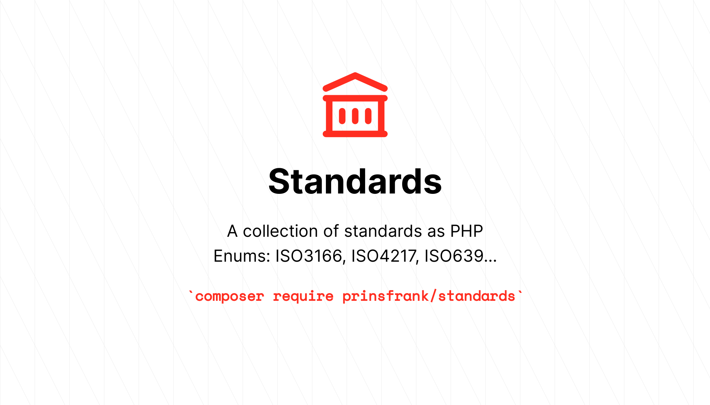
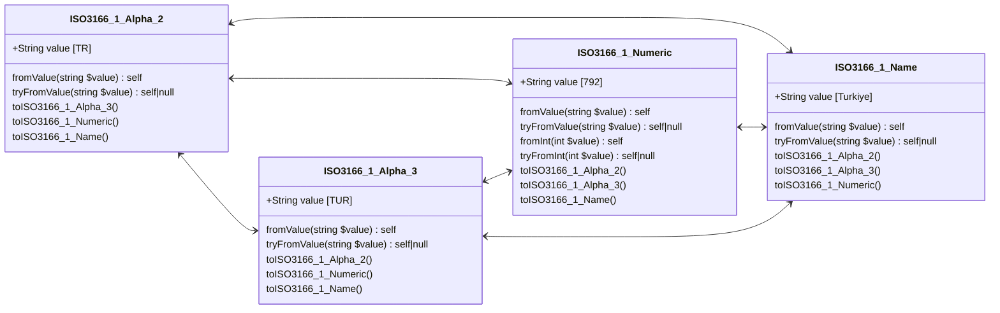
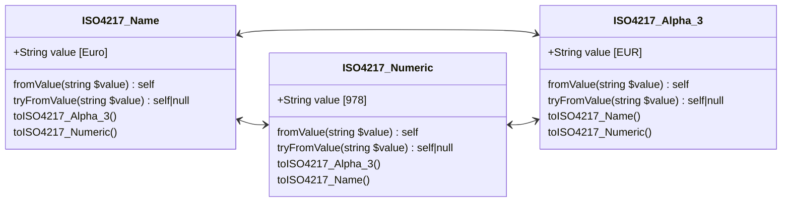
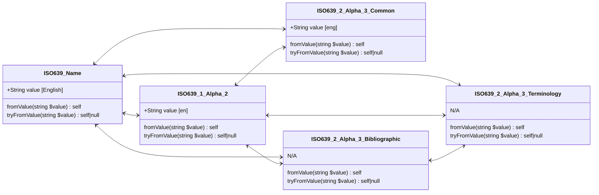

# Standards


[](https://codecov.io/gh/PrinsFrank/standards)
[](https://github.com/PrinsFrank/standards/actions/workflows/update-specs.yml)

**A collection of standards as PHP Enums**

Daily updated from their sources, whether it is ISO or IANA directly, or a maintaining party like the six group or the US library of congress.

## Setup

> **Note**
> Make sure you are running PHP 8.1 or higher to use this package

To start right away, run the following command in your composer project;

```composer require prinsfrank/standards```

Or for development only;

```composer require prinsfrank/standards --dev```

## Country



### ISO 3166-1 Alpha-2

```php
$valueAlpha2 = ISO3166_1_Alpha_2::from('NL');        // ISO3166_1_Alpha_2::Netherlands
$value = $valueAlpha2->value;                        // 'NL'
$valueName = $valueAlpha2->name;                     // 'Netherlands'
$valueAlpha3 = $valueAlpha2->toISO3166_1_Alpha_3();  // ISO3166_1_Alpha_3::Netherlands
$valueNumeric = $valueAlpha2->toISO3166_1_Numeric(); // ISO3166_1_Numeric::Netherlands
```

### ISO 3166-1 Alpha-3

```php
$valueAlpha3 = ISO3166_1_Alpha_3::from('NLD');       // ISO3166_1_Alpha_3::Netherlands
$value = $valueAlpha3->value;                        // 'NLD'
$valueName = $valueAlpha3->name;                     // 'Netherlands'
$valueAlpha2 = $valueAlpha3->toISO3166_1_Alpha_2();  // ISO3166_1_Alpha_2::Netherlands
$valueNumeric = $valueAlpha3->toISO3166_1_Numeric(); // ISO3166_1_Numeric::Netherlands
```

### ISO 3166-1 Numeric

```php
$valueNumeric = ISO3166_1_Numeric::from('528');       // ISO3166_1_Numeric::Netherlands
$valueNumeric = ISO3166_1_Numeric::fromInt(528);      // ISO3166_1_Numeric::Netherlands
$value = $valueNumeric->value;                        // '528'
$valueName = $valueNumeric->name;                     // 'Netherlands'
$valueAlpha2 = $valueNumeric->toISO3166_1_Alpha_2();  // ISO3166_1_Alpha_2::Netherlands
$valueAlpha3 = $valueNumeric->toISO3166_1_Alpha_3();  // ISO3166_1_Alpha_3::Netherlands
```

## Currency



### ISO 4217 Alpha-3

```php
$valueAlpha3 = ISO4217_Alpha_3::from('EUR');        // ISO4217_Alpha_3::Euro
$value = $valueAlpha3->value;                      // 'EUR'
$valueName = $valueAlpha3->name;                   // 'Euro'
$valueNumeric = $valueAlpha3->toISO4217_Numeric(); // ISO4217_Numeric::Euro
```

### ISO 4217 Numeric

```php
$valueNumeric = ISO4217_Numeric::from('978');     // ISO4217_Numeric::Euro
$valueNumeric = ISO4217_Numeric::fromInt(978);    // ISO4217_Numeric::Euro
$value = $valueNumeric->value;                    // '978'
$valueName = $valueNumeric->name;                 // 'Euro'
$valueAlpha3 = $valueNumeric->toISO4217_Alpha_3(); // ISO4217_Alpha_3::Euro
```

## Language




### ISO 639-1

```php
$valueAlpha2 = ISO639_1_Alpha_2::from('nl');                                  // ISO639_1_Alpha_2::Dutch_Flemish
$value = $valueAlpha2->value;                                                 // 'nl'
$valueName = $valueAlpha2->name;                                              // 'Dutch_Flemish'
$valueAlpha3Bibliographic = $valueAlpha2->toISO639_2_Alpha_3_Bibliographic(); // ISO639_2_Alpha_3_Bibliographic::Dutch_Flemish
$valueAlpha3Terminology = $valueAlpha2->toISO639_2_Alpha_3_Terminology();     // ISO639_2_Alpha_3_Terminology::Dutch_Flemish
```

### ISO 639-2 (Common, Bibliographic and Terminology)

```php
$valueAlpha2 = ISO639_2_Alpha_3_Bibliographic::from('dut');               // ISO639_1_Alpha_2::Dutch_Flemish
$value = $valueAlpha2->value;                                             // 'dut'
$valueName = $valueAlpha2->name;                                          // 'Dutch_Flemish'
$valueAlpha2 = $valueAlpha2->toISO639_1_Alpha_2();                        // ISO639_1_Alpha_2::Dutch_Flemish
$valueAlpha3Terminology = $valueAlpha2->toISO639_2_Alpha_3_Terminology(); // ISO639_2_Alpha_3_Terminology::Dutch_Flemish

$valueAlpha2 = ISO639_2_Alpha_3_Terminology::from('nld');                     // ISO639_1_Alpha_2::Dutch_Flemish
$value = $valueAlpha2->value;                                                 // 'nld'
$valueName = $valueAlpha2->name;                                              // 'Dutch_Flemish'
$valueAlpha2 = $valueAlpha2->toISO639_1_Alpha_2();                            // ISO639_1_Alpha_2::Dutch_Flemish
$valueAlpha3Bibliographic = $valueAlpha2->toISO639_2_Alpha_3_Bibliographic(); // ISO639_2_Alpha_3_Bibliographic::Dutch_Flemish
```

## HTTP Status Codes

```php
$code = HttpStatusCode::from(404);                                     // HttpStatusCode::Not_Found
$value = $code->value;                                                 // 404
$valueName = $code->name;                                              // Not_Found
```
