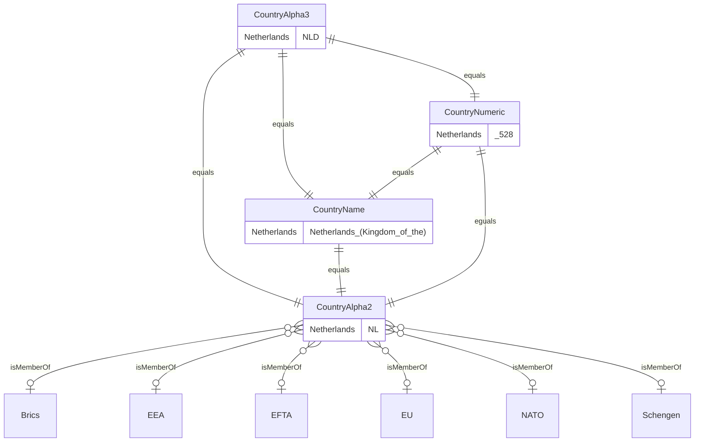

<picture>
    <source srcset="docs/images/banner_dark.png" media="(prefers-color-scheme: dark)">
    
</picture>

# Standards


[](https://codecov.io/gh/PrinsFrank/standards)

**A collection of standards as PHP Enums**

Daily updated from their sources, whether it is ISO or IANA directly, or a maintaining party like the SIX Group or the US Library of Congress.

## Setup

> **Note**
> Make sure you are running PHP 8.1 or higher to use this package

To start right away, run the following command in your composer project;

```composer require prinsfrank/standards```

Or for development only;

```composer require prinsfrank/standards --dev```

## How this package works

This package implements a bunch of specs as PHP Enums, so you can typehint them in methods. Currently, all specs are implemented as backed enums. That means that besides a name, they have also an internal 'value', either as an integer or a string.

In the Country, Currency and language specifications, there is also a relation between different enums. For example, the Alpha2 country code 'NL' is related to the Alpha3 'NLD', the numeric value '528' and the name 'Netherlands (the)'. Internally, these specs rely on the fact that the keys for these values are identical, so it is possible to convert between these.

## Upgrading

This package adheres to [semver](https://semver.org/). This means that there are no breaking changes between minor releases (for example from 1.1 to 1.2), but that breaking changes are released as a major release (for example from 1.x to 2.x). To read about upgrading from one major release to the next, please refer to the [UPGRADING.md](./UPGRADING.md) file in the root of this project. 

## Country (ISO3166-1)

[](https://github.com/PrinsFrank/standards/actions/workflows/update-spec-country.yml)

All the Alpha2, Alpha3, Numeric and Name values have a corresponding enum in the other country enums. These can be converted using their corresponding methods. 

### At a glance

```php
CountryAlpha2::from('NL');                                    // CountryAlpha2::Netherlands
CountryNumeric::from('528');                                  // CountryNumeric::Netherlands
CountryNumeric::fromInt(528);                                 // CountryNumeric::Netherlands
CountryAlpha3::from('NLD');                                   // CountryAlpha3::Netherlands
CountryAlpha3::from('NLD')->value;                            // 'NLD'
CountryAlpha3::from('NLD')->name;                             // 'Netherlands'
CountryAlpha3::from('NLD')->toCountryAlpha2()->value;         // 'NL'
CountryAlpha3::from('NLD')->toCountryNumeric()->value;        // '528'
CountryAlpha3::from('NLD')->toCountryNumeric()->valueAsInt(); // 528
CountryAlpha3::from('NLD')->toCountryName()->value;           // 'Netherlands (Kingdom of the)'
CountryAlpha3::from('NLD')->isMemberOf(EU::class);            // true

public function foo(CountryAlpha2 $countryAlpha2) {}          // Use spec as typehint to enforce valid value

$country = CountryAlpha2::Netherlands;                        // Use specific value from spec explicitly
```

<details>
    <summary>Full documentation</summary>




### CountryAlpha2

```php
$valueAlpha2 = CountryAlpha2::from('NL');         // CountryAlpha2::Netherlands
$value = $valueAlpha2->value;                     // 'NL'
$valueName = $valueAlpha2->name;                  // 'Netherlands'
$valueAlpha3 = $valueAlpha2->toCountryAlpha3();   // CountryAlpha3::Netherlands
$valueNumeric = $valueAlpha2->toCountryNumeric(); // CountryNumeric::Netherlands
$valueName = $valueAlpha2->toCountryName();       // CountryName::Netherlands

$nameString = $valueAlpha2->toCountryName()->value; // 'Netherlands (Kingdom of the)'

$isMemberOfEu = $valueAlpha2->isMemberOf(EU::class);       // true
$isMemberOfBrics = $valueAlpha2->isMemberOf(Brics::class); // false
```

### CountryAlpha3

```php
$valueAlpha3 = CountryAlpha3::from('NLD');        // CountryAlpha3::Netherlands
$value = $valueAlpha3->value;                     // 'NLD'
$valueName = $valueAlpha3->name;                  // 'Netherlands'
$valueAlpha2 = $valueAlpha3->toCountryAlpha2();   // CountryAlpha2::Netherlands
$valueNumeric = $valueAlpha3->toCountryNumeric(); // CountryNumeric::Netherlands
$valueName = $valueAlpha3->toCountryName();       // CountryName::Netherlands

$nameString = $valueAlpha3->toCountryName()->value; // 'Netherlands (Kingdom of the)'

$isMemberOfEu = $valueAlpha3->isMemberOf(EU::class);       // true
$isMemberOfBrics = $valueAlpha3->isMemberOf(Brics::class); // false
```

### CountryNumeric

```php
$valueNumeric = CountryNumeric::from('528');     // CountryNumeric::Netherlands
$valueNumeric = CountryNumeric::fromInt(528);    // CountryNumeric::Netherlands
$value = $valueNumeric->value;                   // '528'
$valueName = $valueNumeric->name;                // 'Netherlands'
$valueAlpha2 = $valueNumeric->toCountryAlpha2(); // CountryAlpha2::Netherlands
$valueAlpha3 = $valueNumeric->toCountryAlpha3(); // CountryAlpha3::Netherlands
$valueName = $valueNumeric->toCountryName();     // CountryName::Netherlands

$nameString = $valueNumeric->toCountryName()->value; // 'Netherlands (Kingdom of the)'

$isMemberOfEu = $valueNumeric->isMemberOf(EU::class);       // true
$isMemberOfBrics = $valueNumeric->isMemberOf(Brics::class); // false
```

### CountryName

```php
$valueName = CountryName::from('Netherlands (Kingdom of the)'); // CountryName::Netherlands
$value = $valueName->value;                                     // 'Netherlands (Kingdom of the)'
$valueName = $valueName->name;                                  // 'Netherlands'
$valueAlpha2 = $valueName->toCountryAlpha2();                   // CountryAlpha2::Netherlands
$valueAlpha3 = $valueName->toCountryAlpha3();                   // CountryAlpha3::Netherlands
$valueNumeric = $valueName->toCountryNumeric();                 // CountryNumeric::Netherlands

$isMemberOfEu = $valueName->isMemberOf(EU::class);       // true
$isMemberOfBrics = $valueName->isMemberOf(Brics::class); // false
```

</details>

## Currency (ISO4217)

[](https://github.com/PrinsFrank/standards/actions/workflows/update-spec-currency.yml)

All the Alpha3, Numeric and Name values have a corresponding enum in the other currency enums. [These can be converted using their corresponding methods](/docs/currency.md).

| Key          | CurrencyAlpha3 | CurrencyNumeric | CurrencyName |
|--------------|----------------|-----------------|--------------|
| Euro         | EUR            | 978             | Euro         |
| Turkish_Lira | TRY            | 949             | Turkish Lira |
| ...          | ...            | ...             | ...          |

## Language (ISO639)

[](https://github.com/PrinsFrank/standards/actions/workflows/update-spec-language.yml)

The language specification is a bit more complex, as there are 20 alpha3 codes that have both a Bibliographic and a Terminology code. All the other ones have a common one. So if you decide you want the alpha3 representation of an alpha2 code, you can convert it to either Terminology or Bibliographic, where if it is not available you will get an instance of the common enum. [More documentation can be found here](/docs/language.md).

| Key           | LanguageAlpha2 | LanguageAlpha3Bibliographic | LanguageAlpha3Common | LanguageAlpha3Terminology | LanguageName   |
|---------------|----------------|-----------------------------|----------------------|---------------------------|----------------|
| Dutch_Flemish | nl             | dut                         |                      | nld                       | Dutch; Flemish |
| Turkish       | tr             |                             | tur                  |                           | Turkish        |
| ...           | ...            | ...                         | ...                  | ...                       | ...            |

## Country Calling Codes (ITU-T E.164)

Country calling codes are quite straight forward. One Exception is that the +1 prefix is used across a lot of countries, and there is no standard for sub-numbering plans. 

| Key                        | InternationalCallPrefix |
|----------------------------|-------------------------|
| Netherlands_Kingdom_of_the | 31                      |
| Turkey                     | 90                      |

## HTTP Status Codes

[](https://github.com/PrinsFrank/standards/actions/workflows/update-spec-http-status-codes.yml)

HTTP Status codes are quite straightforward. For some code examples [you can look in the documentation](/docs/http_status_code.md).

| Key               | HttpStatusCode |
|-------------------|----------------|
| Moved_Permanently | 301            |
| Not_Found         | 404            |
| ...               | ...            |

## HTTP Methods

[](https://github.com/PrinsFrank/standards/actions/workflows/update-spec-http-methods.yml)

| Key             | Value            |
|-----------------|------------------|
| Post            | POST             |
| Put             | PUT              |
| BaselineControl | BASELINE-CONTROL |
| ...             | ...              |

## Geographic regions
| Key    | Value |
|--------|-------|
| World  | 001   |
| Africa | 002   |

## Scripts

[](https://github.com/PrinsFrank/standards/actions/workflows/update-spec-scripts.yml)

