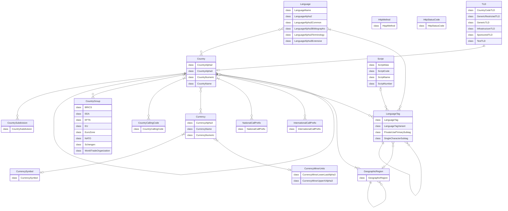
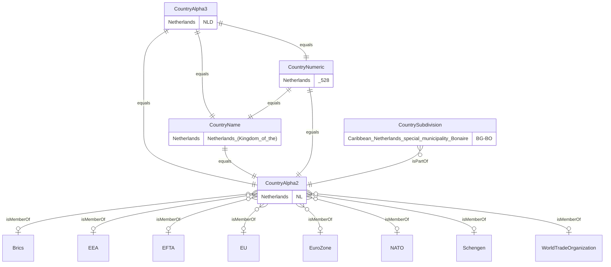
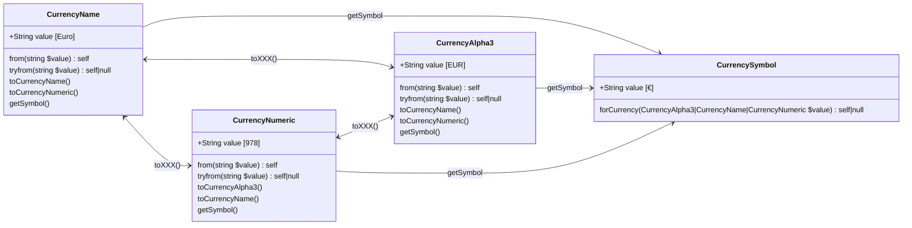

<picture>
    <source srcset="https://github.com/PrinsFrank/standards/raw/main/docs/images/banner_dark.png" media="(prefers-color-scheme: dark)">
    
</picture>

# Standards

[](https://github.com/PrinsFrank/standards/blob/main/LICENSE)
[](https://github.com/PrinsFrank/standards/blob/main/composer.json)
[](https://packagist.org/packages/prinsfrank/standards/stats)
[](https://codecov.io/gh/PrinsFrank/standards)
[](https://github.com/PrinsFrank/standards/blob/main/phpstan.neon)

**A collection of standards as PHP Enums**

Daily updated from their sources, whether it is ISO or IANA directly, or a maintaining party like the SIX Group or the US Library of Congress.

## Setup

> **Note**
> Make sure you are running PHP 8.1 or higher to use this package

To start right away, run the following command in your composer project;

```bash
composer require prinsfrank/standards
```

Or for development only;

```bash
composer require prinsfrank/standards --dev
```

## Daily updated from their source

[](https://github.com/PrinsFrank/standards/actions/workflows/update-spec-country.yml)
[](https://github.com/PrinsFrank/standards/actions/workflows/update-spec-country-calling-code.yml)
[](https://github.com/PrinsFrank/standards/actions/workflows/update-spec-currency.yml)
[](https://github.com/PrinsFrank/standards/actions/workflows/update-spec-eu.yml)
[](https://github.com/PrinsFrank/standards/actions/workflows/update-spec-wto.yml)
[](https://github.com/PrinsFrank/standards/actions/workflows/update-spec-http-methods.yml)
[](https://github.com/PrinsFrank/standards/actions/workflows/update-spec-http-status-codes.yml)
[](https://github.com/PrinsFrank/standards/actions/workflows/update-spec-language-extensive.yml)
[](https://github.com/PrinsFrank/standards/actions/workflows/update-spec-language.yml)
[](https://github.com/PrinsFrank/standards/actions/workflows/update-spec-language-sub-tag.yml)
[](https://github.com/PrinsFrank/standards/actions/workflows/update-spec-php-regex-scripts.yml)
[](https://github.com/PrinsFrank/standards/actions/workflows/update-spec-scripts.yml)
[](https://github.com/PrinsFrank/standards/actions/workflows/update-spec-tld.yml)

## How this package works

This package implements a bunch of specs as PHP Enums, so you can typehint them in methods. Currently, all specs are implemented as backed enums. That means that besides a name, they have also an internal 'value', either as an integer or a string.

In the Country, Currency and language specifications, there is also a relation between different enums. For example, the Alpha2 country code 'NL' is related to the Alpha3 'NLD', the numeric value '528' and the name 'Netherlands (the)'. Internally, these specs rely on the fact that the keys for these values are identical, so it is possible to convert between these.

## Entities and their relations

All specifications in this package are closely related, except for the Http status code and methods. Not all relations are bidirectional though. For example, a language tag is build up of a language and optionally a country, but only a country cannot be converted to a language tag. 

Below you can find an overview of all the relationships between specifications.



## Upgrading

This package adheres to [semver](https://semver.org/). This means that there are no breaking changes between minor releases (for example from 1.1 to 1.2), but that breaking changes are released as a major release (for example from 1.x to 2.x). To read about upgrading from one major release to the next, please refer to the [UPGRADING.md](./UPGRADING.md) file in the root of this project. 

## Some powerful use cases

__Format a complete phone number string based on the users country;__


__Automatically select a supported language from an HTTP request;__


__Listing all country calling codes sorted by country name in a dropdown;__


## Country (ISO3166-1)

[](https://github.com/PrinsFrank/standards/actions/workflows/update-spec-country.yml)

> :mortar_board: **Alpha2/3 country codes are always UPPERCASE to avoid confusion with language codes. It is recommended to use Alpha2/Alpha3 codes when exposing the specification in APIs**

### At a glance

All the Alpha2, Alpha3, Numeric and Name values have a corresponding enum in the other country enums. These can be converted using their corresponding methods (toAlpha2, toAlpha3 etc...).

Country group membership can be checked by calling the `isMemberOf` method, supplying the FQN of a class that implements the `GroupInterface`. Several country groups are available: BRICS, EEA, EFTA etc. Countries can also have subdivisions, which can be of several types: countries, provinces, etc.

```php
use PrinsFrank\Standards\Country\CountryAlpha2;
use PrinsFrank\Standards\Country\CountryAlpha3;
use PrinsFrank\Standards\Country\CountryNumeric;

CountryAlpha2::from('NL');                                      // CountryAlpha2::Netherlands
CountryNumeric::from('528');                                    // CountryNumeric::Netherlands
CountryNumeric::fromInt(528);                                   // CountryNumeric::Netherlands
CountryAlpha3::from('NLD');                                     // CountryAlpha3::Netherlands
CountryAlpha3::from('NLD')->value;                              // 'NLD'
CountryAlpha3::from('NLD')->name;                               // 'Netherlands'
CountryAlpha3::from('NLD')->toCountryAlpha2()->value;           // 'NL'
CountryAlpha3::from('NLD')->toCountryNumeric()->value;          // '528'
CountryAlpha3::from('NLD')->toCountryNumeric()->valueAsInt();   // 528
CountryAlpha3::from('NLD')->isMemberOf(EU::class);              // true
CountryAlpha2::Netherlands;                                     // CountryAlpha2::Netherlands

CountryAlpha2::Vanuatu->getSubdivisions();                      // [CountrySubdivision::Vanuatu_province_Malampa, CountrySubdivision::Vanuatu_province_Penama, CountrySubdivision::Vanuatu_province_Sanma, CountrySubdivision::Vanuatu_province_Shefa, CountrySubdivision::Vanuatu_province_Tafea, CountrySubdivision::Vanuatu_province_Torba]

CountryAlpha2::Aruba->getParentCountry();                       // CountryAlpha2::Netherlands
CountryAlpha2::Netherlands->getSubCountries();                  // [CountryAlpha2::Aruba, CountryAlpha2::Curacao, CountryAlpha2::Sint_Maarten_Dutch_part, CountryAlpha2::Bonaire_Sint_Eustatius_and_Saba]

CountryAlpha3::from('NLD')->getCountryCallingCodes();           // [CountryCallingCode::Netherlands_Kingdom_of_the]
CountryAlpha3::from('NLD')->getCountryCallingCodes()[0]->value; // 31

CountryAlpha3::from('NLD')->getInternationalCallPrefix();        // InternationalCallPrefix::_00
CountryAlpha3::from('NLD')->getInternationalCallPrefix()->value; // '00'

CountryAlpha3::from('NLD')->getNationalCallPrefix();             // NationalCallPrefix::_0
CountryAlpha3::from('NLD')->getNationalCallPrefix()->value;      // '0'

CountryAlpha3::from('NLD')->getFlagEmoji();                      // '🇳🇱' (This might not be displayed correctly in this readme if you're on windows, see 'https://prinsfrank.nl/2021/01/25/Non-existing-flag-emojis-on-windows to make these flag emojis visible for Windows users.')
CountryAlpha3::from('NLD')->getCurrenciesAlpha3();               // [CurrencyAlpha3::Euro]
CountryAlpha3::from('NLD')->getOfficialAndDeFactoLanguages();    // [LanguageAlpha2::Dutch_Flemish]

CountryAlpha3::from('NLD')->getNameInLanguage(LanguageAlpha2::Dutch_Flemish): // 'Nederland'
CountryAlpha3::from('NLD')->getNameInLanguage(LanguageAlpha2::English):       // 'Netherlands'

CountryAlpha3::from('NLD')->formatNumber(42.42, LanguageAlpha2::Dutch_Flemish); // '42,42'

public function foo(CountryAlpha2 $countryAlpha2) {}             // Use spec as typehint to enforce valid value

```

<details>
    <summary>Full documentation</summary>



### CountryAlpha2

```php
use PrinsFrank\Standards\Country\CountryAlpha2;
use PrinsFrank\Standards\Country\Groups\EU;
use PrinsFrank\Standards\Country\Groups\Brics;
use PrinsFrank\Standards\Language\LanguageAlpha2;

$valueAlpha2 = CountryAlpha2::from('NL');         // CountryAlpha2::Netherlands
$value = $valueAlpha2->value;                     // 'NL'
$lowerCaseValue = $valueAlpha2->lowerCaseValue(); // 'nl'
$valueName = $valueAlpha2->name;                  // 'Netherlands'
$valueAlpha3 = $valueAlpha2->toCountryAlpha3();   // CountryAlpha3::Netherlands
$valueNumeric = $valueAlpha2->toCountryNumeric(); // CountryNumeric::Netherlands

$isMemberOfEu = $valueAlpha2->isMemberOf(EU::class);       // true
$isMemberOfBrics = $valueAlpha2->isMemberOf(Brics::class); // false

$valueAlpha2->getCountryCallingCodes();           // [CountryCallingCode::Netherlands_Kingdom_of_the]
$valueAlpha2->getCountryCallingCodes()[0]->value; // 31

$valueAlpha2->getInternationalCallPrefix();        // InternationalCallPrefix::_00
$valueAlpha2->getInternationalCallPrefix()->value; // '00'

$valueAlpha2->getNationalCallPrefix();             // NationalCallPrefix::_0
$valueAlpha2->getNationalCallPrefix()->value;      // '0'

$valueAlpha2::from('NL')->getFlagEmoji();         // '🇳🇱' (This might not be displayed correctly in this readme if you're on windows, see 'https://prinsfrank.nl/2021/01/25/Non-existing-flag-emojis-on-windows to make these flag emojis visible for Windows users.')

$valueAlpha2->getCurrenciesAlpha3();               // [CurrencyAlpha3::Euro]

$valueAlpha2->getOfficialAndDeFactoLanguages();    // [LanguageAlpha2::Dutch_Flemish]

$valueAlpha2->getNameInLanguage(LanguageAlpha2::Dutch_Flemish): // 'Nederland'
$valueAlpha2->getNameInLanguage(LanguageAlpha2::English):       // 'Netherlands'

$valueAlpha2->formatNumber(42.42, LanguageAlpha2::Dutch_Flemish); // '42,42'
```

### CountryAlpha3

```php
use PrinsFrank\Standards\Country\CountryAlpha3;
use PrinsFrank\Standards\Country\Groups\EU;
use PrinsFrank\Standards\Country\Groups\Brics;
use PrinsFrank\Standards\Language\LanguageAlpha2;

$valueAlpha3 = CountryAlpha3::from('NLD');        // CountryAlpha3::Netherlands
$value = $valueAlpha3->value;                     // 'NLD'
$valueName = $valueAlpha3->name;                  // 'Netherlands'
$valueAlpha2 = $valueAlpha3->toCountryAlpha2();   // CountryAlpha2::Netherlands
$valueNumeric = $valueAlpha3->toCountryNumeric(); // CountryNumeric::Netherlands

$isMemberOfEu = $valueAlpha3->isMemberOf(EU::class);       // true
$isMemberOfBrics = $valueAlpha3->isMemberOf(Brics::class); // false

$valueAlpha3->getCountryCallingCodes();           // [CountryCallingCode::Netherlands_Kingdom_of_the]
$valueAlpha3->getCountryCallingCodes()[0]->value; // 31

$valueAlpha3->getInternationalCallPrefix();        // InternationalCallPrefix::_00
$valueAlpha3->getInternationalCallPrefix()->value; // '00'

$valueAlpha3->getNationalCallPrefix();             // NationalCallPrefix::_0
$valueAlpha3->getNationalCallPrefix()->value;      // '0'

$valueAlpha3->getFlagEmoji();                      // '🇳🇱' (This might not be displayed correctly in this readme if you're on windows, see 'https://prinsfrank.nl/2021/01/25/Non-existing-flag-emojis-on-windows to make these flag emojis visible for Windows users.')

$valueAlpha3->getCurrenciesAlpha3();               // [CurrencyAlpha3::Euro]

$valueAlpha3->getOfficialAndDeFactoLanguages();    // [LanguageAlpha2::Dutch_Flemish]

$valueAlpha3->getNameInLanguage(LanguageAlpha2::Dutch_Flemish): // 'Nederland'
$valueAlpha3->getNameInLanguage(LanguageAlpha2::English):       // 'Netherlands'

$valueAlpha2->formatNumber(42.42, LanguageAlpha2::Dutch_Flemish); // '42,42'
```

### CountryNumeric

```php
use PrinsFrank\Standards\Country\CountryNumeric;
use PrinsFrank\Standards\Country\Groups\EU;
use PrinsFrank\Standards\Country\Groups\Brics;
use PrinsFrank\Standards\Language\LanguageAlpha2;

$valueNumeric = CountryNumeric::from('528');     // CountryNumeric::Netherlands
$valueNumeric = CountryNumeric::fromInt(528);    // CountryNumeric::Netherlands
$value = $valueNumeric->value;                   // '528'
$valueName = $valueNumeric->name;                // 'Netherlands'
$valueAlpha2 = $valueNumeric->toCountryAlpha2(); // CountryAlpha2::Netherlands
$valueAlpha3 = $valueNumeric->toCountryAlpha3(); // CountryAlpha3::Netherlands

$isMemberOfEu = $valueNumeric->isMemberOf(EU::class);       // true
$isMemberOfBrics = $valueNumeric->isMemberOf(Brics::class); // false

$valueNumeric->getCountryCallingCodes();           // [CountryCallingCode::Netherlands_Kingdom_of_the]
$valueNumeric->getCountryCallingCodes()[0]->value; // 31

$valueNumeric->getInternationalCallPrefix();        // InternationalCallPrefix::_00
$valueNumeric->getInternationalCallPrefix()->value; // '00'

$valueNumeric->getNationalCallPrefix();             // NationalCallPrefix::_0
$valueNumeric->getNationalCallPrefix()->value;      // '0'

$valueNumeric->getFlagEmoji();                      // '🇳🇱' (This might not be displayed correctly in this readme if you're on windows, see 'https://prinsfrank.nl/2021/01/25/Non-existing-flag-emojis-on-windows to make these flag emojis visible for Windows users.')

$valueNumeric->getCurrenciesAlpha3();               // [CurrencyAlpha3::Euro]

$valueNumeric->getOfficialAndDeFactoLanguages();    // [LanguageAlpha2::Dutch_Flemish]

$valueNumeric->getNameInLanguage(LanguageAlpha2::Dutch_Flemish): // 'Nederland'
$valueNumeric->getNameInLanguage(LanguageAlpha2::English):       // 'Netherlands'

$valueAlpha2->formatNumber(42.42, LanguageAlpha2::Dutch_Flemish); // '42,42'
```

### CountrySubdivision

```php
use PrinsFrank\Standards\Country\Subdivision\CountrySubdivision;

$subdivision = CountrySubdivision::from('VU-MAP');           // CountrySubdivision::Vanuatu_province_Malampa
$subdivision = CountrySubdivision::Vanuatu_province_Malampa; // CountrySubdivision::Vanuatu_province_Malampa

$subdivision->getPartOfCountry();                            // CountryAlpha2::Vanuatu

$subdivision->getNames();                                    // [new ('Malampa', [LanguageAlpha2::French, LanguageAlpha2::English], null, null)]

$subdivision->getSameAsCountry();                            // null
```

### <s>CountryName</s> (Deprecated)

```php
use PrinsFrank\Standards\Country\CountryName;
use PrinsFrank\Standards\Country\Groups\EU;
use PrinsFrank\Standards\Country\Groups\Brics;

$valueName = CountryName::from('Netherlands (Kingdom of the)'); // CountryName::Netherlands
$value = $valueName->value;                                     // 'Netherlands (Kingdom of the)'
$valueName = $valueName->name;                                  // 'Netherlands'
$valueAlpha2 = $valueName->toCountryAlpha2();                   // CountryAlpha2::Netherlands
$valueAlpha3 = $valueName->toCountryAlpha3();                   // CountryAlpha3::Netherlands
$valueNumeric = $valueName->toCountryNumeric();                 // CountryNumeric::Netherlands

$isMemberOfEu = $valueName->isMemberOf(EU::class);       // true
$isMemberOfBrics = $valueName->isMemberOf(Brics::class); // false

$valueName->getCountryCallingCodes();           // [CountryCallingCode::Netherlands_Kingdom_of_the]
$valueName->getCountryCallingCodes()[0]->value; // 31

$valueName->getInternationalCallPrefix();        // InternationalCallPrefix::_00
$valueName->getInternationalCallPrefix()->value; // '00'

$valueName->getNationalCallPrefix();             // NationalCallPrefix::_0
$valueName->getNationalCallPrefix()->value;      // '0'

$valueName->getFlagEmoji();                      // '🇳🇱' (This might not be displayed correctly in this readme if you're on windows, see 'https://prinsfrank.nl/2021/01/25/Non-existing-flag-emojis-on-windows to make these flag emojis visible for Windows users.')

$valueName->getCurrenciesAlpha3();               // [CurrencyAlpha3::Euro]

$valueName->getOfficialAndDeFactoLanguages();    // [LanguageAlpha2::Dutch_Flemish]
```

</details>

## Country Calling Codes (ITU-T E.164)

> :mortar_board: **Country calling codes can be anywhere from 1 to 3 digits, and can span several countries. There are no leading zeros in this specification.**

### At a glance

Country calling codes are quite straight forward. One country can have multiple country calling codes though, And one country calling code can span multiple countries. That's why the `forCountry` and `getCountriesAlpha2` both return an array of country calling codes/countries and not a single item.

```php
use PrinsFrank\Standards\Country\CountryAlpha2;
use PrinsFrank\Standards\CountryCallingCode\CountryCallingCode;

CountryCallingCode::from(1);                    // CountryCallingCode::Integrated_numbering_plan
CountryCallingCode::from(31);                   // CountryCallingCode::Netherlands_Kingdom_of_the
CountryCallingCode::from(31)->value;            // 31
CountryCallingCode::from(31)->name;             // 'Netherlands_Kingdom_of_the'
CountryCallingCode::Netherlands_Kingdom_of_the; // CountryCallingCode::Netherlands_Kingdom_of_the

CountryCallingCode::from(31)->getCountriesAlpha2(); // [CountryAlpha2::Netherlands]
CountryCallingCode::from(7)->getCountriesAlpha2();  // [CountryAlpha2::Kazakhstan, CountryAlpha2::Russian_Federation]

CountryCallingCode::forCountry(CountryAlpha2::Netherlands); // [CountryCallingCode::Netherlands_Kingdom_of_the]

public function foo(CountryCallingCode $countryCallingCode) {} // Use spec as typehint to enforce valid value
```

## Currency (ISO4217)

[](https://github.com/PrinsFrank/standards/actions/workflows/update-spec-currency.yml)

> :mortar_board: **Alpha3 codes are uppercase. When communicating or storing currencies, it is recommended to do so using the Alpha3 or Numeric representation.**

### At a glance

All the Alpha3, Numeric and Name values have a corresponding enum in the other currency enums. These can be converted using their corresponding methods (toCurrencyAlpha3, etc...). A fourth enum is available that maps all currencies to a currency symbol, that can be accessed by calling the 'getSymbol' method.

```php
use PrinsFrank\Standards\Country\CountryAlpha2;
use PrinsFrank\Standards\Currency\CurrencyAlpha3;
use PrinsFrank\Standards\Currency\CurrencyName;
use PrinsFrank\Standards\Currency\CurrencyNumeric;
use PrinsFrank\Standards\Currency\CurrencySymbol;

CurrencyAlpha3::from('EUR');                               // CurrencyAlpha3::Euro
CurrencyAlpha3::from('EUR')->value;                        // 'EUR'
CurrencyAlpha3::from('EUR')->lowercaseValue();             // 'eur'
CurrencyAlpha3::from('EUR')->toCurrencyName()->value;      // 'Euro'
CurrencyAlpha3::from('EUR')->getSymbol();                  // CurrencySymbol::Euro
CurrencyAlpha3::from('EUR')->getSymbol()->value;           // '€'
CurrencyAlpha3::from('EUR')->toCurrencyNumeric()->value;   // '978'
CurrencyAlpha3::from('EUR')->getMinorUnits();              // 2
CurrencyNumeric::from('978');                              // CurrencyNumeric::Euro
CurrencyNumeric::fromInt(978);                             // CurrencyNumeric::Euro
CurrencyNumeric::from('978')->value;                       // '978'
CurrencyNumeric::from('978')->valueAsInt();                // 978
CurrencySymbol::from('€');                                 // CurrencySymbol::Euro
CurrencySymbol::from('€')->value;                          // '€'
CurrencySymbol::forCurrency(CurrencyAlpha3::Euro);         // CurrencySymbol::Euro
CurrencySymbol::forCurrency(CurrencyNumeric::Euro);        // CurrencySymbol::Euro
CurrencySymbol::forCurrency(CurrencyName::Euro);           // CurrencySymbol::Euro
CurrencySymbol::forCurrency(CurrencyNumeric::from('978')); // CurrencySymbol::Euro
CurrencyAlpha3::Euro;                                      // CurrencyAlpha3::Euro

CurrencyAlpha3::Euro->format(42.42, CountryAlpha2::Netherlands);                                // '€ 42,42'
CurrencyAlpha3::Euro->format(42.42, CountryAlpha2::Netherlands, LanguageAlpha2::Dutch_Flemish); // '€ 42,42'

CurrencyAlpha3::Norwegian_Krone->getCountriesAlpha2();     // [CountryAlpha2::Bouvet_Island, CountryAlpha2::Norway, CountryAlpha2::Svalbard_Jan_Mayen]

public function foo(CurrencyAlpha3 $currencyAlpha3) {}     // Use spec as typehint to enforce valid value
```

<details>
    <summary>Full documentation</summary>



### CurrencyAlpha3

```php
use PrinsFrank\Standards\Country\CountryAlpha2;
use PrinsFrank\Standards\Currency\CurrencyAlpha3;
use PrinsFrank\Standards\Language\LanguageAlpha2;

$currencyAlpha3 = CurrencyAlpha3::from('EUR');         // CurrencyAlpha3::Euro
$value = $currencyAlpha3->value;                       // 'EUR'
$value = $currencyAlpha3->lowercaseValue();            // 'eur'
$valueName = $currencyAlpha3->name;                    // 'Euro'
$minorUnits = $currencyAlpha3->getMinorUnits();        // 2
$valueNumeric = $currencyAlpha3->toCurrencyNumeric();  // CurrencyNumeric::Euro
$valueName = $currencyAlpha3->toCurrencyName();        // CurrencyName::Euro
$valueName = $currencyAlpha3->toCurrencyName()->value; // 'Euro'
$valueSymbol = $currencyAlpha3->getSymbol();           // CurrencySymbol::Euro
$valueSymbol = $currencyAlpha3->getSymbol()->value;    // '€'
$countries = $currencyAlpha2->getCountriesAlpha2();    // [CountryAlpha2::Bouvet_Island, CountryAlpha2::Norway, CountryAlpha2::Svalbard_Jan_Mayen]

$currencyAlpha3->format(42.42, CountryAlpha2::Netherlands);                                // '€ 42,42'
$currencyAlpha3->format(42.42, CountryAlpha2::Netherlands, LanguageAlpha2::Dutch_Flemish); // '€ 42,42'
```

### CurrencyNumeric

```php
use PrinsFrank\Standards\Currency\CurrencyNumeric;
use PrinsFrank\Standards\Country\CountryAlpha2;
use PrinsFrank\Standards\Language\LanguageAlpha2;

$currencyNumeric = CurrencyNumeric::from('978');        // CurrencyNumeric::Euro
$currencyNumeric = CurrencyNumeric::fromInt(978);       // CurrencyNumeric::Euro
$value = $currencyNumeric->value;                       // '978'
$value = $currencyNumeric->valueAsInt();                // 978
$valueName = $currencyNumeric->name;                    // 'Euro'
$minorUnits = $currencyNumeric->getMinorUnits();        // 2
$valueAlpha3 = $currencyNumeric->toCurrencyAlpha3();    // CurrencyAlpha3::Euro
$valueName = $currencyNumeric->toCurrencyName();        // CurrencyName::Euro
$valueName = $currencyNumeric->toCurrencyName()->value; // 'Euro'
$valueSymbol = $currencyNumeric->getSymbol();           // CurrencySymbol::Euro
$valueSymbol = $currencyNumeric->getSymbol()->value;    // '€'
$countries = $currencyNumeric->getCountriesAlpha2();    // [CountryAlpha2::Bouvet_Island, CountryAlpha2::Norway, CountryAlpha2::Svalbard_Jan_Mayen]

$currencyNumeric->format(42.42, CountryAlpha2::Netherlands);                                // '€ 42,42'
$currencyNumeric->format(42.42, CountryAlpha2::Netherlands, LanguageAlpha2::Dutch_Flemish); // '€ 42,42'
```

### CurrencySymbol

```php
use PrinsFrank\Standards\Currency\CurrencyAlpha3;
use PrinsFrank\Standards\Currency\CurrencySymbol;

$currencySymbol = CurrencySymbol::from('€');                        // CurrencySymbol::Euro
$currencySymbol =  $currencySymbol->name;                           // 'Euro'
$currencySymbol =  $currencySymbol->value;                          // '€'
$currencySymbol = CurrencySymbol::forCurrency(CurrencyAlpha3::Euro) // CurrencySymbol::Euro
```

### CurrencyName

```php
use PrinsFrank\Standards\Currency\CurrencyName;
use PrinsFrank\Standards\Country\CountryAlpha2;
use PrinsFrank\Standards\Language\LanguageAlpha2;

$currencyName = CurrencyName::from('Euro');        // CurrencyName::Euro 
$currencyName = CurrencyName::Euro;                // CurrencyName::Euro
$name = $currencyName->name;                       // 'Euro'
$value = $currencyName->value;                     // 'Euro'
$minorUnits = $currencyName->getMinorUnits();      // 2
$valueAlpha3 = $currencyName->toCurrencyAlpha3();  // CurrencyAlpha3::Euro
$valueAlpha3 = $currencyName->toCurrencyNumeric(); // CurrencyNumeric::Euro
$countries = $currencyName->getCountriesAlpha2();  // [CountryAlpha2::Bouvet_Island, CountryAlpha2::Norway, CountryAlpha2::Svalbard_Jan_Mayen]

$currencyName->format(42.42, CountryAlpha2::Netherlands);                                // '€ 42,42'
$currencyName->format(42.42, CountryAlpha2::Netherlands, LanguageAlpha2::Dutch_Flemish); // '€ 42,42'
```


</details>

## HTTP Methods

[](https://github.com/PrinsFrank/standards/actions/workflows/update-spec-http-methods.yml)

### At a glance

```php
use PrinsFrank\Standards\Http\HttpMethod;

HttpMethod::from('POST');        // HttpMethod::Post
HttpMethod::from('POST')->value; // 'POST'
HttpMethod::from('POST')->name;  // Post
HttpMethod::Post;                // HttpMethod::Post

public function foo(HttpMethod $httpMethod) {} // Use spec as typehint to enforce valid value
```

## HTTP Status Codes

[](https://github.com/PrinsFrank/standards/actions/workflows/update-spec-http-status-codes.yml)

### At a glance

```php
use PrinsFrank\Standards\Http\HttpStatusCode;

HttpStatusCode::from(404);       // HttpStatusCode::Not_Found
HttpStatusCode::from(404->value; // 404
HttpStatusCode::from(404->name;  // Not_Found
HttpStatusCode::Not_Found;       // HttpStatusCode::Not_Found

public function foo(HttpStatusCode $httpStatusCode) {} // Use spec as typehint to enforce valid value
```

There can be status codes that are temporarily assigned. Those are marked with the `TemporaryAssignment` attribute. To check if a specific case is temporarily assigned, you can use the `isTemporaryAssignment` method which returns a boolean, or `getTemporaryAssignmentExpiresAt` which returns a DateTimeImmutable or null.

## International Call Prefixes (ITU-T E.164)

Different countries have different international call prefixes. This is a spec extracted from ITU-T E.164 listing all possible international call prefixes.

### At a glance

```php
use PrinsFrank\Standards\InternationalCallPrefix\InternationalCallPrefix;
use PrinsFrank\Standards\Country\CountryAlpha2;
use PrinsFrank\Standards\Country\CountryAlpha3;
use PrinsFrank\Standards\Country\CountryName;
use PrinsFrank\Standards\Country\CountryNumeric;

InternationalCallPrefix::from('0');                // InternationalCallPrefix::_0
InternationalCallPrefix::from('0')->value;         // '0'
InternationalCallPrefix::from('0')->name;          // '_0'
InternationalCallPrefix::_0;                       // InternationalCallPrefix::_0
InternationalCallPrefix::_0->getCountriesAlpha2(); // [CountryAlpha2::Samoa]

InternationalCallPrefix::forCountry(CountryAlpha2::Netherlands);  // InternationalCallPrefix::_00
InternationalCallPrefix::forCountry(CountryAlpha3::Netherlands);  // InternationalCallPrefix::_00
InternationalCallPrefix::forCountry(CountryNumeric::Netherlands); // InternationalCallPrefix::_00
InternationalCallPrefix::forCountry(CountryName::Netherlands);    // InternationalCallPrefix::_00

public function foo(InternationalCallPrefix $internationalCallPrefix) {} // Use spec as typehint to enforce valid value
```

## Language (ISO639)

[](https://github.com/PrinsFrank/standards/actions/workflows/update-spec-language.yml)
[](https://github.com/PrinsFrank/standards/actions/workflows/update-spec-language-extensive.yml)

> :mortar_board: **Language codes are always in lowercase to avoid confusion with country codes.**

> :mortar_board: **The alpha2 specification has 184 languages, the alpha3 Bibliographic/Terminology specification has 486 languages and the alpha3 Extensive specification has 7908 languages.**

> :mortar_board: **If you have to choose between the alpha3 Bibliographic and Terminology specification, the Terminology specification is more widely used.**

### At a glance

There are four language code specifications:
- 184 Language Alpha2 (ISO 639-1)
- 486 Language Alpha3 Bibliographic (ISO 639-2)
- 486 Language Alpha3 Terminology (ISO 639-2)
- 7908 Language Alpha3 Extensive (ISO 639-3)

As you see, the Bibliographic and Terminology specifications have an identical number of languages, so there is a one-to-one relation between these.

```php
use PrinsFrank\Standards\Language\LanguageAlpha2;
use PrinsFrank\Standards\Language\LanguageAlpha3Terminology;
use PrinsFrank\Standards\Language\LanguageAlpha3Extensive;

LanguageAlpha2::from('nl');                                         // LanguageAlpha2::Dutch_Flemish
LanguageAlpha2::from('nl')->value;                                  // 'nl'
LanguageAlpha2::from('nl')->name;                                   // 'Dutch_Flemish'
LanguageAlpha2::from('nl')->toLanguageAlpha3Bibliographic();        // LanguageAlpha3Bibliographic::Dutch_Flemish
LanguageAlpha2::from('nl')->toLanguageAlpha3Bibliographic()->value; // 'dut'
LanguageAlpha2::from('nl')->toLanguageAlpha3Terminology();          // LanguageAlpha3Terminology::Dutch_Flemish
LanguageAlpha2::from('nl')->toLanguageAlpha3Terminology()->value;   // 'nld'
LanguageAlpha2::from('nl')->toLanguageName()->value;                // 'Dutch; Flemish'

LanguageAlpha3Terminology::from('nld');                             // LanguageAlpha3Terminology::Dutch_Flemish
LanguageAlpha3Bibliographic::from('dut');                           // LanguageAlpha3Bibliographic::Dutch_Flemish

LanguageAlpha3Extensive::from('nld');                               // LanguageAlpha3Extensive::Dutch
LanguageAlpha3Extensive::from('dse');                               // LanguageAlpha3Extensive::Dutch_Sign_Language

LanguageAlpha2::Dutch_Flemish->getNameInLanguage(LanguageAlpha2::Dutch_Flemish); // 'Nederlands'
LanguageAlpha2::Dutch_Flemish->getNameInLanguage(LanguageAlpha2::English);       // 'Dutch'

public function foo(LanguageAlpha2 $languageAlpha2);                // Use spec as typehint to enforce valid value
```

<details>
    <summary>Full documentation</summary>

### LanguageAlpha2 (ISO 639-1)

```php
use PrinsFrank\Standards\Language\LanguageAlpha2;

$valueAlpha2 = LanguageAlpha2::from('nl');                                 // LanguageAlpha2::Dutch_Flemish
$value = $valueAlpha2->value;                                              // 'nl'
$valueName = $valueAlpha2->name;                                           // 'Dutch_Flemish'
$valueAlpha3Bibliographic = $valueAlpha2->toLanguageAlpha3Bibliographic(); // LanguageAlpha3Bibliographic::Dutch_Flemish
$valueAlpha3Terminology = $valueAlpha2->toLanguageAlpha3Terminology();     // LanguageAlpha3Terminology::Dutch_Flemish
$valueAlpha3Terminology->getNameInLanguage(LanguageAlpha2::Dutch_Flemish); // 'Nederlands'
$valueAlpha3Terminology->getNameInLanguage(LanguageAlpha2::English);       // 'Dutch'
```

### LanguageAlpha3Bibliographic (ISO 639-2)

```php
use PrinsFrank\Standards\Language\LanguageAlpha2;
use PrinsFrank\Standards\Language\LanguageAlpha3Bibliographic;

$valueAlpha3 = LanguageAlpha3Bibliographic::from('dut');               // LanguageAlpha3Bibliographic::Dutch_Flemish
$value = $valueAlpha3->value;                                          // 'dut'
$valueName = $valueAlpha3->name;                                       // 'Dutch_Flemish'
$valueAlpha2 = $valueAlpha3->toLanguageAlpha2();                       // LanguageAlpha2::Dutch_Flemish
$valueAlpha3Terminology = $valueAlpha3->toLanguageAlpha3Terminology(); // LanguageAlpha3Terminology::Dutch_Flemish
$valueAlpha3Bibliographic->getNameInLanguage(LanguageAlpha2::Dutch_Flemish); // 'Nederlands'
$valueAlpha3Bibliographic->getNameInLanguage(LanguageAlpha2::English);       // 'Dutch'
```

### LanguageAlpha3Terminology (ISO 639-2)

```php
use PrinsFrank\Standards\Language\LanguageAlpha2;
use PrinsFrank\Standards\Language\LanguageAlpha3Terminology;

$valueAlpha3 = LanguageAlpha3Terminology::from('nld');                     // LanguageAlpha3Terminology::Dutch_Flemish
$value = $valueAlpha3->value;                                              // 'nld'
$valueName = $valueAlpha3->name;                                           // 'Dutch_Flemish'
$valueAlpha2 = $valueAlpha3->toLanguageAlpha2();                           // LanguageAlpha2::Dutch_Flemish
$valueAlpha3Bibliographic = $valueAlpha3->toLanguageAlpha3Bibliographic(); // LanguageAlpha3Bibliographic::Dutch_Flemish
$valueAlpha3Terminology->getNameInLanguage(LanguageAlpha2::Dutch_Flemish); // 'Nederlands'
$valueAlpha3Terminology->getNameInLanguage(LanguageAlpha2::English);       // 'Dutch'
```

### LanguageAlpha3Extensive (ISO 639-3)

```php
use PrinsFrank\Standards\Language\LanguageAlpha3Extensive;

$valueAlpha3 = LanguageAlpha3Extensive::from('nld'); // LanguageAlpha3Extensive::Dutch
$value = $valueAlpha3->value;                        // 'nld'
$valueName = $valueAlpha3->name;                     // 'Dutch'
```

</details>

## Language Tags (RFC 5646)

> :mortar-board: **Language tags always have a primary tag, and can have an extension, script, region, one or more variants, one or more extension and/or a private subtag.**

### At a glance

```php
use PrinsFrank\Standards\Country\CountryAlpha2;
use PrinsFrank\Standards\Language\LanguageTag;
use PrinsFrank\Standards\Language\LanguageAlpha2;
use PrinsFrank\Standards\LanguageTag\LanguageTagVariant;

LanguageTag::tryFromString('');            // null
LanguageTag::fromString();                 // InvalidArgumentException
LanguageTag::fromString('nl');             // LanguageTag(LanguageAlpha2::Dutch_Flemish);
LanguageTag::fromString('i-enochian');     // LanguageTag(SingleCharacterSubtag::GRANDFATHERED, privateUseSubtag: 'enochian')
LanguageTag::fromString('zh-Hant');        // LanguageTag(LanguageAlpha2::Chinese, script: ScriptSubtag::Han_Traditional_variant)
LanguageTag::fromString('sr-Cyrl');        // LanguageTag(LanguageAlpha2::Serbian, scriptSubtag: ScriptCode::Cyrillic)
LanguageTag::fromString('zh-cmn-Hans-CN'); // LanguageTag(LanguageAlpha2::Chinese, LanguageAlpha3Extensive::Mandarin_Chinese, ScriptCode::Han_Simplified_variant, CountryAlpha2::China)
LanguageTag::fromString('sl-rozaj-biske'); // LanguageTag(LanguageAlpha2::Slovenian, variantSubtag: [LanguageTagVariant::Rezijan, LanguageTagVariant::The_Bila_dialect_of_Resian])
LanguageTag::fromString('de-CH-1901');     // LanguageTag(LanguageAlpha2::German, regionSubtag: CountryAlpha2::Switzerland, variantSubtag: [LanguageTagVariant::Traditional_German_orthography])

LanguageTag::fromString('de-CH-1901')->primaryLanguageSubtag; // LanguageAlpha2::German
LanguageTag::fromString('de-CH-1901')->regionSubtag;          // CountryAlpha2::Switzerland

LanguageAlpha2::Dutch_Flemish->toLanguageTag(); // 'nl'
LanguageAlpha2::German->toLanguageTag(regionSubtag: CountryAlpha2::Switzerland, variantSubtag: [LanguageTagVariant::Traditional_German_orthography]); // 'de-CH-1901'

public function foo(LanguageTag $languageTag): {} // Use spec as typehint to enforce valid value
```

## Geographic regions (M49)

> :mortar_board: **Geographic regions are represented by three digits. Leading zeros are required. Each geographic region can span multiple other geographic regions or countries.**

### At a glance

```php
use PrinsFrank\Standards\Region\GeographicRegion;

GeographicRegion::from('150');        // GeographicRegion::Europe
GeographicRegion::from('150')->value; // '150'
GeographicRegion::from('150')->name;  // Europe
GeographicRegion::Europe;             // GeographicRegion::Europe

GeographicRegion::from('150')->getDirectSubRegions();   // [GeographicRegion::Eastern_Europe, GeographicRegion::Northern_Europe, ...]
GeographicRegion::from('150')->getAllSubRegions();      // [GeographicRegion::Eastern_Europe, GeographicRegion::Northern_Europe, ...]

GeographicRegion::from('150')->getDirectSubCountries(); // []
GeographicRegion::from('150')->getAllSubCountries();    // [CountryNumeric::Belarus, CountryNumeric::Bulgaria, ...]

public function foo(GeographicRegion $geographicRegion) {} // Use spec as typehint to enforce valid value
```

## National Call Prefixes (ITU-T E.164)

Different countries have different national call prefixes;

### At a glance

```php
use PrinsFrank\Standards\NationalCallPrefix\NationalCallPrefix;
use PrinsFrank\Standards\Country\CountryAlpha2;
use PrinsFrank\Standards\Country\CountryAlpha3;
use PrinsFrank\Standards\Country\CountryNumeric;
use PrinsFrank\Standards\Country\CountryName;

NationalCallPrefix::from('0');                // NationalCallPrefix::_0
NationalCallPrefix::from('0')->value;         // '0'
NationalCallPrefix::from('0')->name;          // '_0'
NationalCallPrefix::_0;                       // NationalCallPrefix::_0

NationalCallPrefix::forCountry(CountryAlpha2::Netherlands);  // NationalCallPrefix::_0
NationalCallPrefix::forCountry(CountryAlpha3::Netherlands);  // NationalCallPrefix::_0
NationalCallPrefix::forCountry(CountryNumeric::Netherlands); // NationalCallPrefix::_0
NationalCallPrefix::forCountry(CountryName::Netherlands);    // NationalCallPrefix::_0

public function foo(NationalCallPrefix $nationalCallPrefix) {} // Use spec as typehint to enforce valid value
```

## Scripts

[](https://github.com/PrinsFrank/standards/actions/workflows/update-spec-scripts.yml)

### At a glance

```php
use PrinsFrank\Standards\Scripts\ScriptAlias;
use PrinsFrank\Standards\Scripts\ScriptCode;
use PrinsFrank\Standards\Scripts\ScriptName;
use PrinsFrank\Standards\Scripts\ScriptNumber;

ScriptAlias::from('Latin');                    // ScriptAlias::Latin
ScriptAlias::from('Latin')->value;             // 'Latin'
ScriptAlias::from('Latin')->name;              // 'Latin'
ScriptAlias::Latin;                            // ScriptAlias::Latin
ScriptAlias::from('Latin')->toScriptCode();    // ScriptCode::Latin
ScriptCode::from('Latn');                      // ScriptCode::Latin
ScriptName::from('Latin');                     // ScriptName::Latin
ScriptNumber::from('215');                     // ScriptNumber::Latin

ScriptAlias::Latin->isSupportedByPHPRegex();   // true
ScriptAlias::allForString('еюeuеюευ');         // [ScriptAlias::Cyrillic, ScriptAlias::Greek, ScriptAlias::Latin]
ScriptAlias::hasMultipleForString('еюeuеюευ'); // true
ScriptAlias::mostCommonInString('еюeuеюευ');   // ScriptAlias::Cyrillic

public function foo(ScriptAlias $scriptAlias) {} // Use spec as typehint to enforce valid value
```

<details>
    <summary>Full documentation</summary>

### ScriptAlias

```php
use PrinsFrank\Standards\Scripts\ScriptAlias;

ScriptAlias::from('Latin');                          // ScriptAlias::latin
ScriptAlias::from('Latin')->value;                   // 'Latin'
ScriptAlias::from('Latin')->name;                    // 'Latin'
ScriptAlias::from('Latin')->toScriptCode();          // ScriptCode::Latin
ScriptAlias::from('Latin')->toScriptName();          // ScriptName::Latin
ScriptAlias::from('Latin')->toScriptNumber();        // ScriptNumber::Latin
ScriptAlias::Latin;                                  // ScriptAlias::Latin
ScriptAlias::from('Latin')->isSupportedByPHPRegex(); // true

ScriptAlias::allForString('еюeuеюευ');               // [ScriptAlias::Cyrillic, ScriptAlias::Greek, ScriptAlias::Latin]
ScriptAlias::hasMultipleForString('еюeuеюευ');       // true
ScriptAlias::mostCommonInString('еюeuеюευ');         // ScriptAlias::Cyrillic

public function foo(ScriptAlias $scriptAlias) {} // Use spec as typehint to enforce valid value
```

PHP has regex support for detecting scripts using the following notation:

Match any Arabic character
```regexp
\p{Arabic}
```

Match any NON-Arabic character
```regexp
\P{Arabic}
```

Not all scripts are supported by PHP regular expressions. An exhaustive list can be found in the [PHP documentation for Unicode character properties](https://www.php.net/manual/en/regexp.reference.unicode.php). For convenience, the information on that page is parsed daily and supplied in this package using the `isSupportedByPHPRegex` method and `SupportedByPHPRegex` attribute which is the underlying information used by the `isSupportedByPHPRegex` method.

### ScriptCode

```php
use PrinsFrank\Standards\Scripts\ScriptCode;

ScriptCode::from('Latn');                     // ScriptCode::latin
ScriptCode::from('Latn')->value;              // 'Latin'
ScriptCode::from('Latn')->name;               // 'Latin'
ScriptCode::from('Latn')->toScriptAlias();    // ScriptAlias::Latin
ScriptCode::from('Latn')->toScriptName();     // ScriptName::Latin
ScriptCode::from('Latn')->toScriptNumber();   // ScriptNumber::Latin
ScriptCode::Latin;                            // ScriptCode::Latin

ScriptCode::allForString('еюeuеюευ');         // [ScriptCode::Cyrillic, ScriptCode::Greek, ScriptCode::Latin]
ScriptCode::hasMultipleForString('еюeuеюευ'); // true
ScriptCode::mostCommonInString('еюeuеюευ');   // ScriptCode::Cyrillic

public function foo(ScriptCode $scriptCode) {} // Use spec as typehint to enforce valid value
```

### ScriptName

```php
use PrinsFrank\Standards\Scripts\ScriptName;

ScriptName::from('Latin');                    // ScriptName::latin
ScriptName::from('Latin')->value;             // 'Latin'
ScriptName::from('Latin')->name;              // 'Latin'
ScriptName::from('Latin')->toScriptCode();    // ScriptCode::Latin
ScriptName::from('Latin')->toScriptAlias();   // ScriptAlias::Latin
ScriptName::from('Latin')->toScriptNumber();  // ScriptNumber::Latin
ScriptName::Latin;                            // ScriptName::Latin

ScriptName::allForString('еюeuеюευ');         // [ScriptName::Cyrillic, ScriptName::Greek, ScriptName::Latin]
ScriptName::hasMultipleForString('еюeuеюευ'); // true
ScriptName::mostCommonInString('еюeuеюευ');   // ScriptName::Cyrillic

public function foo(ScriptName $scriptName) {} // Use spec as typehint to enforce valid value
```

### ScriptNumber

```php
use PrinsFrank\Standards\Scripts\ScriptNumber;

ScriptNumber::from('215');                      // ScriptNumber::latin
ScriptNumber::from('215')->value;               // 'Latin'
ScriptNumber::from('215')->name;                // 'Latin'
ScriptNumber::from('215')->toScriptCode();      // ScriptCode::Latin
ScriptNumber::from('215')->toScriptName();      // ScriptName::Latin
ScriptNumber::from('215')->toScriptAlias();     // ScriptAlias::Latin
ScriptNumber::Latin;                            // ScriptNumber::Latin

ScriptNumber::allForString('еюeuеюευ');         // [ScriptNumber::Cyrillic, ScriptAlias::Greek, ScriptAlias::Latin]
ScriptNumber::hasMultipleForString('еюeuеюευ'); // true
ScriptNumber::mostCommonInString('еюeuеюευ');   // ScriptNumber::Cyrillic

public function foo(ScriptNumber $scriptNumber) {} // Use spec as typehint to enforce valid value
```

</details>

## TLDs

[](https://github.com/PrinsFrank/standards/actions/workflows/update-spec-tld.yml)

There are currently 6 types of Top Level Domains:
- CountryCode
- GenericRestricted
- Generic
- Infrastructure
- Sponsored
- Test

Most of these specification have several TLDs that are 'unmanaged' and are thus not currently available. Those are marked as deprecated, but are kept in the specification. There is one exception: All Test TLDs are always unmanaged and are thus never marked as deprecated.

### CountryCodeTLD

Where a TLD is marked as unmanaged by IANA it is marked as deprecated.

```php
use PrinsFrank\Standards\TopLevelDomain\CountryCodeTLD;

CountryCodeTLD::from('nl');                      // CountryCodeTLD::nl
CountryCodeTLD::nl;                              // CountryCodeTLD::nl
CountryCodeTLD::from('nl')->value;               // 'nl'
CountryCodeTLD::from('nl')->name;                // 'nl'
CountryCodeTLD::from('nl')->isAssigned();        // true
CountryCodeTLD::from('nl')->getCountryAlpha2();  // CountryAlpha2::Netherlands
CountryCodeTLD::from('nl')->getCountryAlpha3();  // CountryAlpha3::Netherlands
CountryCodeTLD::from('nl')->getCountryNumeric(); // CountryNumeric::Netherlands

public function foo(CountryCodeTLD $countryCodeTLD) {} // Use spec as typehint to enforce valid value
```

### GenericRestrictedTLD

Where a TLD is marked as unmanaged by IANA it is marked as deprecated.

```php
use PrinsFrank\Standards\TopLevelDomain\GenericRestrictedTLD;

GenericRestrictedTLD::from('name');                // GenericRestrictedTLD::name
GenericRestrictedTLD::name;                        // GenericRestrictedTLD::name
GenericRestrictedTLD::from('name')->value;         // 'name'
GenericRestrictedTLD::from('name')->name;          // 'name'
GenericRestrictedTLD::from('name')->isAssigned();  // true

public function foo(GenericRestrictedTLD $genericRestrictedTLD) {} // Use spec as typehint to enforce valid value
```

### GenericTLD

Where a TLD is marked as unmanaged by IANA it is marked as deprecated.

```php
use PrinsFrank\Standards\TopLevelDomain\GenericTLD;

GenericTLD::from('aaa');                // GenericTLD::aaa
GenericTLD::aaa;                        // GenericTLD::aaa
GenericTLD::from('aaa')->value;         // 'aaa'
GenericTLD::from('aaa')->name;          // 'aaa'
GenericTLD::from('aaa')->isAssigned();  // true

public function foo(GenericTLD $genericTLD) {} // Use spec as typehint to enforce valid value
```

### InfrastructureTLD

Where a TLD is marked as unmanaged by IANA it is marked as deprecated.

```php
use PrinsFrank\Standards\TopLevelDomain\InfrastructureTLD;

InfrastructureTLD::from('arpa');                // InfrastructureTLD::arpa
InfrastructureTLD::arpa;                        // InfrastructureTLD::arpa
InfrastructureTLD::from('arpa')->value;         // 'arpa'
InfrastructureTLD::from('arpa')->name;          // 'arpa'
InfrastructureTLD::from('arpa')->isAssigned();  // true

public function foo(InfrastructureTLD $infrastructureTLD) {} // Use spec as typehint to enforce valid value
```

### SponsoredTLD

Where a TLD is marked as unmanaged by IANA it is marked as deprecated.

```php
use PrinsFrank\Standards\TopLevelDomain\SponsoredTLD;

SponsoredTLD::from('aero');                // SponsoredTLD::aero
SponsoredTLD::arpa;                        // SponsoredTLD::aero
SponsoredTLD::from('aero')->value;         // 'aero'
SponsoredTLD::from('aero')->name;          // 'aero'
SponsoredTLD::from('aero')->isAssigned();  // true

public function foo(SponsoredTLD $sponsoredTLD) {} // Use spec as typehint to enforce valid value
```

### TestTLD

All Test TLDs are always unmanaged and are thus never marked as deprecated.

```php
use PrinsFrank\Standards\TopLevelDomain\TestTLD;

TestTLD::from('テスト');              // TestTLD::tesuto_katakana
TestTLD::tesuto_katakana;            // TestTLD::tesuto_katakana
TestTLD::from('テスト')->value;       // 'テスト'
TestTLD::from('テスト')->name;        // 'tesuto_katakana'
TestTLD::from('テスト')->isAssigned() // false

public function foo(TestTLD $testTLD) {} // Use spec as typehint to enforce valid value
```
