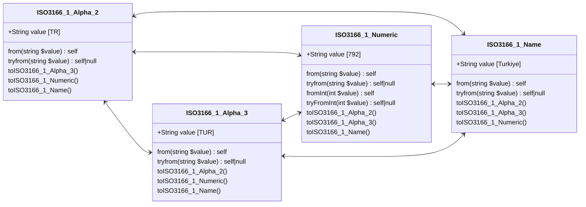

# Country



### ISO 3166-1 Alpha-2

```php
$valueAlpha2 = ISO3166_1_Alpha_2::from('NL');        // ISO3166_1_Alpha_2::Netherlands
$value = $valueAlpha2->value;                        // 'NL'
$valueName = $valueAlpha2->name;                     // 'Netherlands'
$valueAlpha3 = $valueAlpha2->toISO3166_1_Alpha_3();  // ISO3166_1_Alpha_3::Netherlands
$valueNumeric = $valueAlpha2->toISO3166_1_Numeric(); // ISO3166_1_Numeric::Netherlands
```

### ISO 3166-1 Alpha-3

```php
$valueAlpha3 = ISO3166_1_Alpha_3::from('NLD');       // ISO3166_1_Alpha_3::Netherlands
$value = $valueAlpha3->value;                        // 'NLD'
$valueName = $valueAlpha3->name;                     // 'Netherlands'
$valueAlpha2 = $valueAlpha3->toISO3166_1_Alpha_2();  // ISO3166_1_Alpha_2::Netherlands
$valueNumeric = $valueAlpha3->toISO3166_1_Numeric(); // ISO3166_1_Numeric::Netherlands
```

### ISO 3166-1 Numeric

```php
$valueNumeric = ISO3166_1_Numeric::from('528');       // ISO3166_1_Numeric::Netherlands
$valueNumeric = ISO3166_1_Numeric::fromInt(528);      // ISO3166_1_Numeric::Netherlands
$value = $valueNumeric->value;                        // '528'
$valueName = $valueNumeric->name;                     // 'Netherlands'
$valueAlpha2 = $valueNumeric->toISO3166_1_Alpha_2();  // ISO3166_1_Alpha_2::Netherlands
$valueAlpha3 = $valueNumeric->toISO3166_1_Alpha_3();  // ISO3166_1_Alpha_3::Netherlands
```