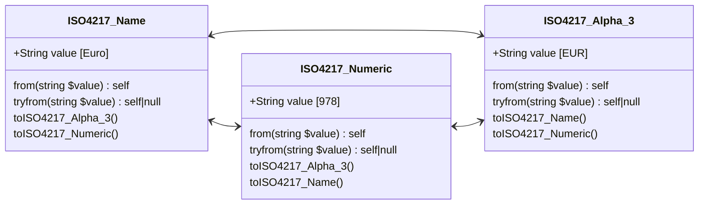

# Currency



### ISO 4217 Alpha-3

```php
$valueAlpha3 = ISO4217_Alpha_3::from('EUR');        // ISO4217_Alpha_3::Euro
$value = $valueAlpha3->value;                      // 'EUR'
$valueName = $valueAlpha3->name;                   // 'Euro'
$valueNumeric = $valueAlpha3->toISO4217_Numeric(); // ISO4217_Numeric::Euro
```

### ISO 4217 Numeric

```php
$valueNumeric = ISO4217_Numeric::from('978');     // ISO4217_Numeric::Euro
$valueNumeric = ISO4217_Numeric::fromInt(978);    // ISO4217_Numeric::Euro
$value = $valueNumeric->value;                    // '978'
$valueName = $valueNumeric->name;                 // 'Euro'
$valueAlpha3 = $valueNumeric->toISO4217_Alpha_3(); // ISO4217_Alpha_3::Euro
```
