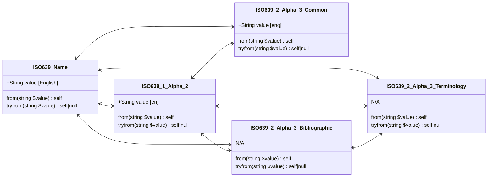
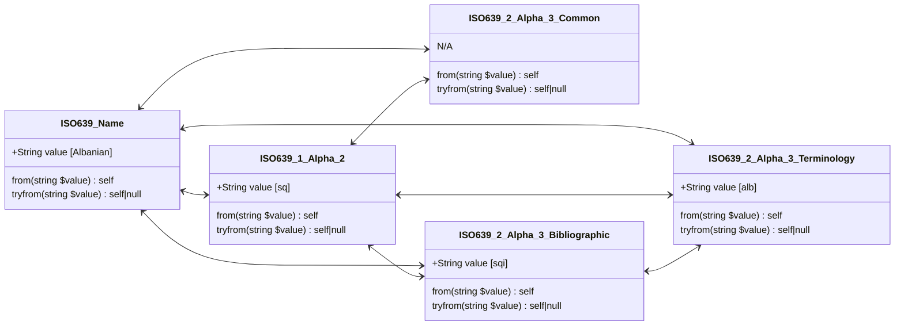

# Language





### ISO 639-1

```php
$valueAlpha2 = ISO639_1_Alpha_2::from('nl');                                  // ISO639_1_Alpha_2::Dutch_Flemish
$value = $valueAlpha2->value;                                                 // 'nl'
$valueName = $valueAlpha2->name;                                              // 'Dutch_Flemish'
$valueAlpha3Bibliographic = $valueAlpha2->toISO639_2_Alpha_3_Bibliographic(); // ISO639_2_Alpha_3_Bibliographic::Dutch_Flemish
$valueAlpha3Terminology = $valueAlpha2->toISO639_2_Alpha_3_Terminology();     // ISO639_2_Alpha_3_Terminology::Dutch_Flemish
```

### ISO 639-2 (Common, Bibliographic and Terminology)

```php
$valueAlpha2 = ISO639_2_Alpha_3_Bibliographic::from('dut');               // ISO639_1_Alpha_2::Dutch_Flemish
$value = $valueAlpha2->value;                                             // 'dut'
$valueName = $valueAlpha2->name;                                          // 'Dutch_Flemish'
$valueAlpha2 = $valueAlpha2->toISO639_1_Alpha_2();                        // ISO639_1_Alpha_2::Dutch_Flemish
$valueAlpha3Terminology = $valueAlpha2->toISO639_2_Alpha_3_Terminology(); // ISO639_2_Alpha_3_Terminology::Dutch_Flemish

$valueAlpha2 = ISO639_2_Alpha_3_Terminology::from('nld');                     // ISO639_1_Alpha_2::Dutch_Flemish
$value = $valueAlpha2->value;                                                 // 'nld'
$valueName = $valueAlpha2->name;                                              // 'Dutch_Flemish'
$valueAlpha2 = $valueAlpha2->toISO639_1_Alpha_2();                            // ISO639_1_Alpha_2::Dutch_Flemish
$valueAlpha3Bibliographic = $valueAlpha2->toISO639_2_Alpha_3_Bibliographic(); // ISO639_2_Alpha_3_Bibliographic::Dutch_Flemish
```
